---
## Front matter
lang: ru-RU
title: Лабораторная работа 
subtitle: Установка ОС Linux
author:
  - Панченко Д. Д.
institute:
  - Российский университет дружбы народов, Москва, Россия
date: 18 февраля 2023

## i18n babel
babel-lang: russian
babel-otherlangs: english

## Formatting pdf
toc: false
toc-title: Содержание
slide_level: 2
aspectratio: 169
section-titles: true
theme: metropolis
header-includes:
 - \metroset{progressbar=frametitle,sectionpage=progressbar,numbering=fraction}
 - '\makeatletter'
 - '\beamer@ignorenonframefalse'
 - '\makeatother'
---

# Информация

## Докладчик

  * Панченко Денис Дмитриевич
  * Студент 1 курса факультета физико-математических наук.
  * Российский университет дружбы народов
  * [derenchikde@gmail.com](mailto:derenchikde@gmail.com)

## Цели и задачи

- Приобрести практических навыков установки операционной системы на виртуальную машину
- Настроить минимально необходимых для дальнейшей работы сервисы

# Выполнение лабораторной работы

## Обновляем все пакеты.

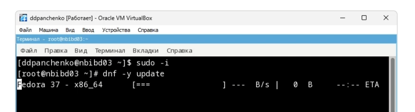

## Устанавливаем пограммы для удобства работы в консоли.

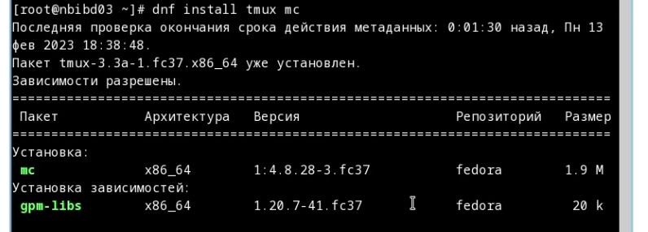

## Устанавливаем программное обеспечение.

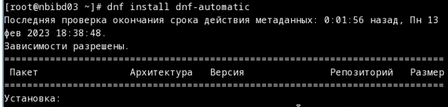

## Запускаем таймер.

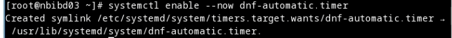

## Отключаем SELinux.

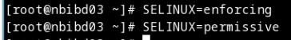

## Устанавливаем пакет DKMS:.

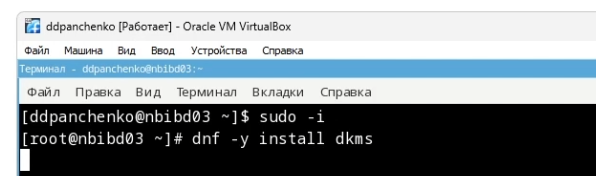

## Подмонтируем диск.

## Установим драйвера.

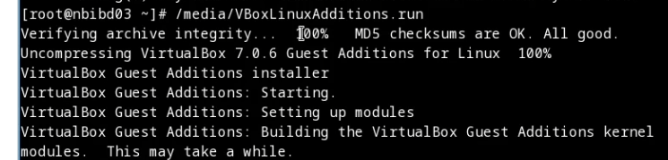

## Настроим раскладку клавиатуры.

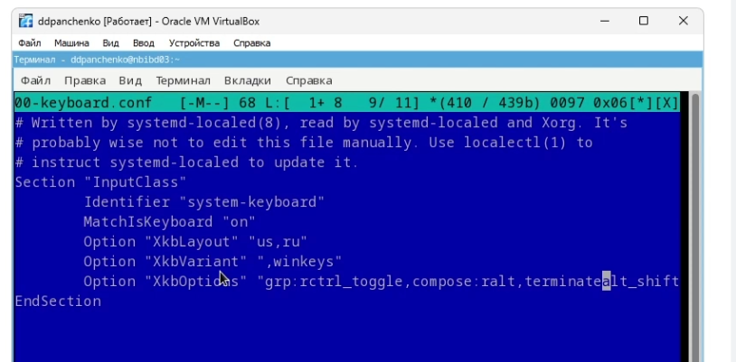

## Установим имя пользователя и название хоста.

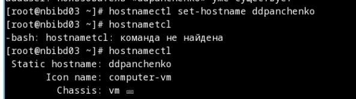

## Установим программное обеспечение для создания документации.

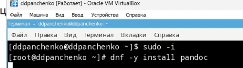

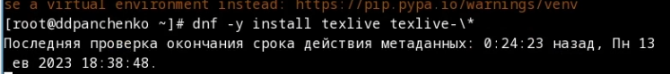

## Проанализируем последовательность загрузки системы, выполнив команду dmesg.

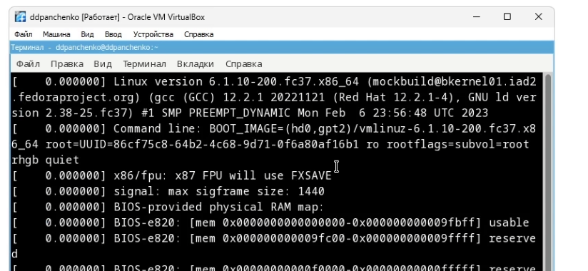

## Поиск с помощью grep.

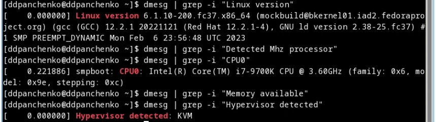

# Вывод

Я научился устанавливать ОС Linux на виртуальную машину, а также настраивать ее.
