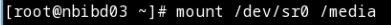

---
## Front matter
title: "Лабораторная работа №1"
subtitle: "Установка ОС Linux"
author: "Панченко Денис Дмитриевич"

## Generic otions
lang: ru-RU
toc-title: "Содержание"

## Bibliography
bibliography: bib/cite.bib
csl: pandoc/csl/gost-r-7-0-5-2008-numeric.csl

## Pdf output format
toc: true # Table of contents
toc-depth: 2
lof: false # List of figures
lot: false # List of tables
fontsize: 12pt
linestretch: 1.5
papersize: a4
documentclass: scrreprt
## I18n polyglossia
polyglossia-lang:
  name: russian
  options:
	- spelling=modern
	- babelshorthands=true
polyglossia-otherlangs:
  name: english
## I18n babel
babel-lang: russian
babel-otherlangs: english
## Fonts
mainfont: PT Serif
romanfont: PT Serif
sansfont: PT Sans
monofont: PT Mono
mainfontoptions: Ligatures=TeX
romanfontoptions: Ligatures=TeX
sansfontoptions: Ligatures=TeX,Scale=MatchLowercase
monofontoptions: Scale=MatchLowercase,Scale=0.9
## Biblatex
biblatex: true
biblio-style: "gost-numeric"
biblatexoptions:
  - parentracker=true
  - backend=biber
  - hyperref=auto
  - language=auto
  - autolang=other*
  - citestyle=gost-numeric
## Pandoc-crossref LaTeX customization
figureTitle: "Рис."
tableTitle: "Таблица"
listingTitle: "Листинг"
lofTitle: "Список иллюстраций"
lotTitle: "Список таблиц"
lolTitle: "Листинги"
## Misc options
indent: true
header-includes:
  - \usepackage{indentfirst}
  - \usepackage{float} # keep figures where there are in the text
  - \floatplacement{figure}{H} # keep figures where there are in the text
---

# Цель работы

Приобретение практических навыков установки операционной системы на виртуальную машину, настройки минимально необходимых для дальнейшей работы сервисов.

# Задание

Установить ОС Linux.

# Выполнение лабораторной работы

Обновляем все пакеты (рис. @fig:001).

{#fig:001 width=70%}

Устанавливаем пограммы для удобства работы в консоли (рис. @fig:002).

{#fig:002 width=70%}

Устанавливаем программное обеспечение (рис. @fig:003).

{#fig:003 width=70%}

Запускаем таймер (рис. @fig:004).

{#fig:004 width=70%}

Отключаем SELinux (рис. @fig:005).

{#fig:005 width=70%}

Устанавливаем пакет DKMS: (рис. @fig:006).

{#fig:006 width=70%}

Подмонтируем диск (рис. @fig:007).

{#fig:007 width=70%}

Установим драйвера (рис. @fig:008).

{#fig:008 width=70%}

Настроим раскладку клавиатуры (рис. @fig:009).

{#fig:009 width=70%}

Установим имя пользователя и название хоста (рис. @fig:010).

{#fig:010 width=70%}

Установим программное обеспечение для создания документации (рис. @fig:011 - @fig:012).

{#fig:011 width=70%}

{#fig:012 width=70%}

# Домашнее задание

Проанализируем последовательность загрузки системы, выполнив команду dmesg (рис. @fig:013).

{#fig:013 width=70%}

Поиск с помощью grep (рис. @fig:014).

{#fig:014 width=70%}

# Контрольные вопросы

1. Какую информацию содержит учётная запись пользователя?
Имя и пароль
2. Укажите команды терминала и приведите примеры:
1) Для получения справки по команде:
help
help cd
2) Для перемещения по файловой системе:
cd
cd /home/ddpanchenko/
3) Для просмотра содержимого каталога:
ls
ls /home/ddpanchenko/
4) Для определения объёма каталога:
du
du /home/ddpanchenko/
5) Для создания / удаления каталогов / файлов:
mkdir / rm
mkdir /home/ddpanchenko/text.txt
rm /home/ddpanchenko/text.txt
6) Для задания определённых прав на файл / каталог:
chmod
chmod /home/ddpanchenko/text.txt
7) Для просмотра истории команд:
history
3. Что такое файловая система?
Файловая система - это часть определенной системы, суть которой состоит в том, чтобы обеспечить пользователю удобный интерфейс при работе с данными, хранящимися на диске, и обеспечить совместное использование файлов несколькими пользователями и процессами.
4. Как посмотреть, какие файловые системы подмонтированы в ОС?
С помощью команды mount
5. Как удалить зависший процесс?
С помощью команды kill

# Вывод

Я научился устанавливать ОС Linux на виртуальную машину.
