---
## Front matter
lang: ru-RU
title: Лабораторная работа 
subtitle: Первоначальна настройка git
author:
  - Панченко Д. Д.
institute:
  - Российский университет дружбы народов, Москва, Россия
date: 18 февраля 2023

## i18n babel
babel-lang: russian
babel-otherlangs: english

## Formatting pdf
toc: false
toc-title: Содержание
slide_level: 2
aspectratio: 169
section-titles: true
theme: metropolis
header-includes:
 - \metroset{progressbar=frametitle,sectionpage=progressbar,numbering=fraction}
 - '\makeatletter'
 - '\beamer@ignorenonframefalse'
 - '\makeatother'
---

# Информация

## Докладчик

  * Панченко Денис Дмитриевич
  * Студент 1 курса факультета физико-математических наук.
  * Российский университет дружбы народов
  * [derenchikde@gmail.com](mailto:derenchikde@gmail.com)

## Цели и задачи

- Изучить идеологию и применение средств контроля версий
- Освоить умения по работе с git

## Задание

1. Создать базовую конфигурацию для работы с git.
2. Создать ключ SSH.
3. Создать ключ PGP.
4. Настроить подписи git.
5. Зарегистрироваться на Github.
6. Создать локальный каталог для выполнения заданий по предмету.

# Выполнение лабораторной работы

## Установим git.

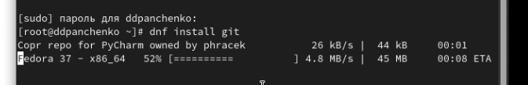

## Установим gh.

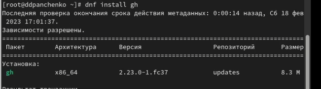

## Зададим имя и email владельца репозитория.

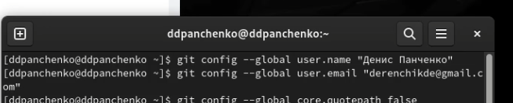

## Настроим utf-8 в выводе сообщений git.

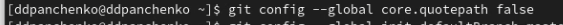

## Зададим имя начальной ветки.

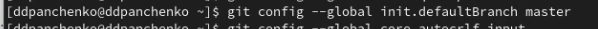

## Параметр autocrlf.

## Параметр safecrlf.

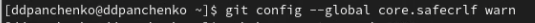

## Создадим ключ ssh по алгоритму rsa с ключём размером 4096 бит.

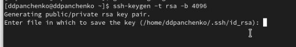

## Создадим ключ ssh по алгоритму ed25519.

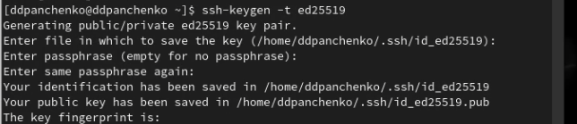

## Создадим ключи pgp.

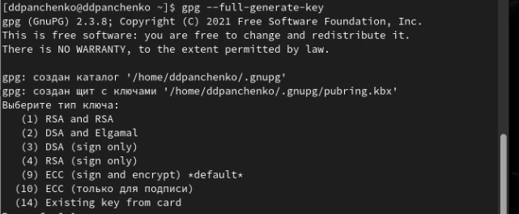

## Добавим PGP ключ в GitHub.

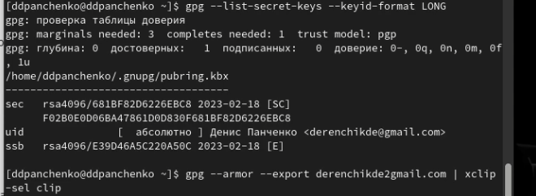

## Настроим автоматические подписи коммитов git.

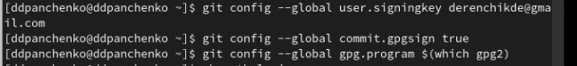

## Настроим gh.

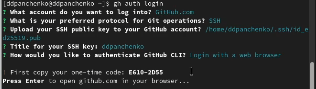

## Добавим шаблон для рабочего пространства.

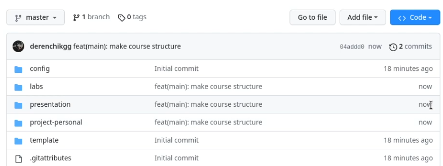

## Создадим репозиторий курса на основе шаблона.

## Настроим каталог курса.

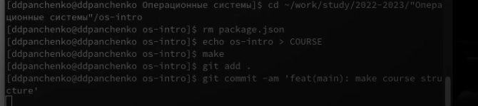

# Вывод

Я освоил умения по работе с git.
