---
## Front matter
title: "Лабораторная работа №2"
subtitle: "Первоначальна настройка git"
author: "Панченко Денис Дмитриевич"

## Generic otions
lang: ru-RU
toc-title: "Содержание"

## Bibliography
bibliography: bib/cite.bib
csl: pandoc/csl/gost-r-7-0-5-2008-numeric.csl

## Pdf output format
toc: true # Table of contents
toc-depth: 2
lof: false # List of figures
lot: false # List of tables
fontsize: 12pt
linestretch: 1.5
papersize: a4
documentclass: scrreprt
## I18n polyglossia
polyglossia-lang:
  name: russian
  options:
	- spelling=modern
	- babelshorthands=true
polyglossia-otherlangs:
  name: english
## I18n babel
babel-lang: russian
babel-otherlangs: english
## Fonts
mainfont: PT Serif
romanfont: PT Serif
sansfont: PT Sans
monofont: PT Mono
mainfontoptions: Ligatures=TeX
romanfontoptions: Ligatures=TeX
sansfontoptions: Ligatures=TeX,Scale=MatchLowercase
monofontoptions: Scale=MatchLowercase,Scale=0.9
## Biblatex
biblatex: true
biblio-style: "gost-numeric"
biblatexoptions:
  - parentracker=true
  - backend=biber
  - hyperref=auto
  - language=auto
  - autolang=other*
  - citestyle=gost-numeric
## Pandoc-crossref LaTeX customization
figureTitle: "Рис."
tableTitle: "Таблица"
listingTitle: "Листинг"
lofTitle: "Список иллюстраций"
lotTitle: "Список таблиц"
lolTitle: "Листинги"
## Misc options
indent: true
header-includes:
  - \usepackage{indentfirst}
  - \usepackage{float} # keep figures where there are in the text
  - \floatplacement{figure}{H} # keep figures where there are in the text
---

# Цель работы

Изучить идеологию и применение средств контроля версий, освоить умения по работе с git.

# Задание

1. Создать базовую конфигурацию для работы с git.
2. Создать ключ SSH.
3. Создать ключ PGP.
4. Настроить подписи git.
5. Зарегистрироваться на Github.
6. Создать локальный каталог для выполнения заданий по предмету.

# Выполнение лабораторной работы

Установим git (рис. @fig:001).

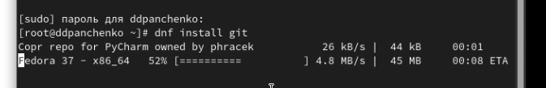{#fig:001 width=70%}

Установим gh (рис. @fig:002).

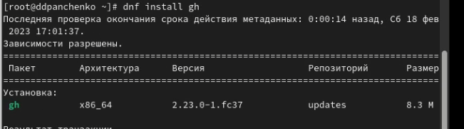{#fig:002 width=70%}

Зададим имя и email владельца репозитория (рис. @fig:003).

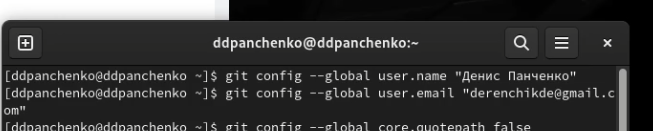{#fig:003 width=70%}

Настроим utf-8 в выводе сообщений git (рис. @fig:004).

{#fig:004 width=70%}

Зададим имя начальной ветки (рис. @fig:005).

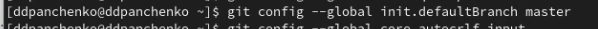{#fig:005 width=70%}

Параметр autocrlf (рис. @fig:006).

{#fig:006 width=70%}

Параметр safecrlf (рис. @fig:007).

{#fig:007 width=70%}

Создадим ключ ssh по алгоритму rsa с ключём размером 4096 бит (рис. @fig:008).

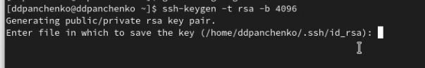{#fig:008 width=70%}

Создадим ключ ssh по алгоритму ed25519 (рис. @fig:009).

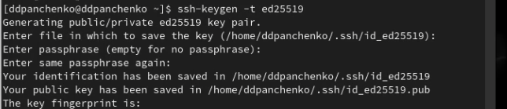{#fig:009 width=70%}

Создадим ключи pgp (рис. @fig:010).

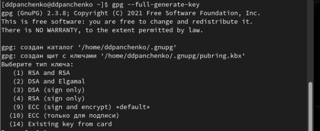{#fig:010 width=70%}

Добавим PGP ключ в GitHub (рис. @fig:011).

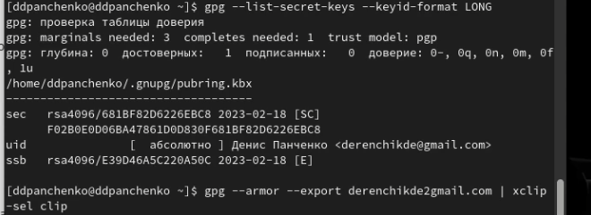{#fig:011 width=70%}

Настроим автоматические подписи коммитов git (рис. @fig:012).

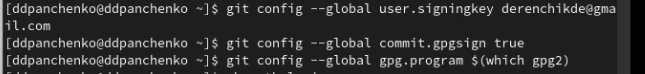{#fig:012 width=70%}

Настроим gh (рис. @fig:013).

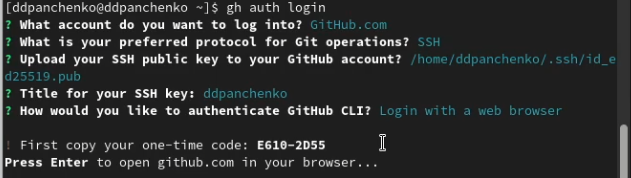{#fig:013 width=70%}

Добавим шаблон для рабочего пространства (рис. @fig:014).

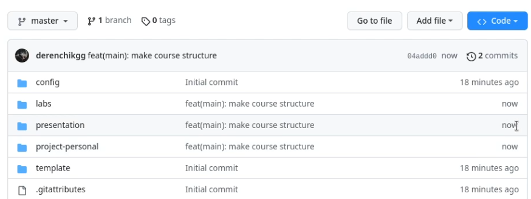{#fig:014 width=70%}

Создадим репозиторий курса на основе шаблона (рис. @fig:015).

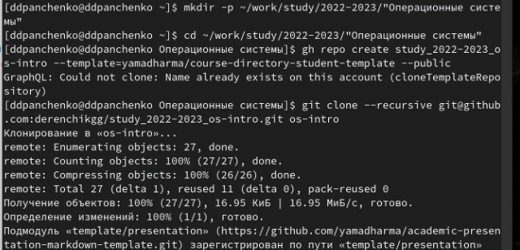{#fig:015 width=70%}

Настроим каталог курса (рис. @fig:016).

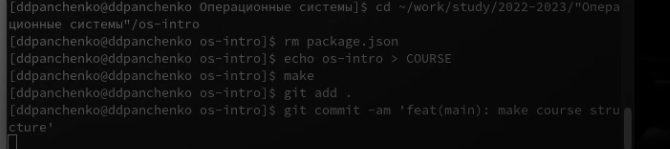{#fig:016 width=70%}

# Контрольные вопросы

1. Что такое системы контроля версий (VCS) и для решения каких задач они предназначаются?
Система контроля версий (Version Control System, VCS) — программное обеспечение для облегчения работы с изменяющейся информацией. VCS позволяет хранить несколько версий одного и того же документа, при необходимости возвращаться к более ранним версиям, определять, кто и когда сделал то или иное изменение, и многое другое.
2. Объясните следующие понятия VCS и их отношения: хранилище, commit, история, рабочая копия.
1) Репозиторий (repository) – специальное хранилище файлов и папок проекта, изменения в которых отслеживаются.
2) Рабочая копия (working copy) проекта, с которой он непосредственно работает.
3) Рабочую копию необходимо периодически синхронизировать с репозиторием, эта операция предполагает отправку в него изменений, которые пользователь внес в свою рабочую копию. Такая операция называется commit.
4) Update - ктуализация рабочей копии, в процессе которой к пользователю загружается последняя версия из репозитория.
3. Что представляют собой и чем отличаются централизованные и децентрализованные VCS? Приведите примеры VCS каждого вида.
1)Централизованные системы контроля версий представляют собой приложения типа клиент-сервер, когда репозиторий проекта существует в единственном экземпляре и хранится на сервере. Доступ к нему осуществлялся через специальное клиентское приложение. В качестве примеров таких программных продуктов можно привести CVS, Subversion.
2)Распределенные системы контроля версий (Distributed Version Control System, DVCS) позволяют хранить репозиторий (его копию) у каждого разработчика, работающего с данной системой. При этом можно выделить центральный репозиторий (условно), в который будут отправляться изменения из локальных и, с ним же эти локальные репозитории будут синхронизироваться. При работе с такой системой, пользователи периодически синхронизируют свои локальные репозитории с центральным и работают непосредственно со своей локальной копией. После внесения достаточного количества изменений в локальную копию они (изменения) отправляются на сервер. При этом сервер, чаще всего, выбирается условно, т.к. в большинстве DVCS нет такого понятия как “выделенный сервер с центральным репозиторием”.
4. Опишите действия с VCS при единоличной работе с хранилищем.
При единоличной работе не нужно использовать сервер.
5. Опишите порядок работы с общим хранилищем VCS.
1) Подготовительная работа Создать репозиторий Скачать проект из репозитория.
2) Ежедневная работа Обновить проект, забрать последнюю версию из репозитория. Внести изменения в репозиторий Разрешить конфликты (merge) Создать бранч (ветку).
6. Каковы основные задачи, решаемые инструментальным средством git?
1) Система контроля версий Git представляет собой набор программ командной строки. Доступ к ним можно получить из терминала посредством ввода команды git с различными опциями.
2) Благодаря тому, что Git является распределённой системой контроля версий, резервную копию локального хранилища можно сделать простым копированием или архивацией.
7. Назовите и дайте краткую характеристику командам git.
1) Создание основного дерева репозитория:
git init
2) Получение обновлений (изменений) текущего дерева из центрального репозитория:
git pull
3) Отправка всех произведённых изменений локального дерева в центральный репозиторий:
git push
4) Просмотр списка изменённых файлов в текущей директории:
git status
5) Просмотр текущих изменений:
git diff
6) Сохранение текущих изменений:
6.1) Добавить все изменённые и/или созданные файлы и/или каталоги:
git add .
6.2) Добавить конкретные изменённые и/или созданные файлы и/или каталоги:
git add имена_файлов
6.3) Удалить файл и/или каталог из индекса репозитория (при этом файл и/или каталог остаётся в локальной директории):
git rm имена_файлов
7) Сохранение добавленных изменений:
7.1) Сохранить все добавленные изменения и все изменённые файлы:
git commit -am 'Описание коммита'
7.2) Сохранить добавленные изменения с внесением комментария через встроенный редактор:
git commit
7.3) Создание новой ветки, базирующейся на текущей:
git checkout -b имя_ветки
7.4) Переключение на некоторую ветку:
git checkout имя_ветки
7.5) Отправка изменений конкретной ветки в центральный репозиторий:
git push origin имя_ветки
7.6) Слияние ветки с текущим деревом:
git merge --no-ff имя_ветки
8) Удаление ветки:
8.1) Удаление локальной уже слитой с основным деревом ветки:
git branch -d имя_ветки
8.2) Принудительное удаление локальной ветки:
git branch -D имя_ветки
8.3) Удаление ветки с центрального репозитория:
git push origin :имя_ветки
8. Приведите примеры использования при работе с локальным и удалённым репозиториями.
1) Создадим локальный репозиторий.
2) Сначала сделаем предварительную конфигурацию, указав имя и email владельца репозитория.
3) Настроим utf-8 в выводе сообщений git.
4) Для инициализации локального репозитория, расположенного, например, в каталоге ~/tutorial, необходимо ввести в командной строке.
5) После это в каталоге tutorial появится каталог .git, в котором будет храниться история изменений.
6) Создадим тестовый текстовый файл hello.txt и добавим его в локальный репозиторий.
7) Воспользуемся командой status для просмотра изменений в рабочем каталоге, сделанных с момента последней ревизии.
8) Во время работы над проектом так или иначе могут создаваться файлы, которые не требуется добавлять в последствии в репозиторий. Например, временные файлы, создаваемые редакторами, или объектные файлы, создаваемые компиляторами. Можно прописать шаблоны игнорируемых при добавлении в репозиторий типов файлов в файл .gitignore с помощью сервисов. Для этого сначала нужно получить список имеющихся шаблонов.
9) Затем скачать шаблон, например, для C и C++
9. Что такое и зачем могут быть нужны ветви (branches)?
Ветки нужны для того, чтобы программисты могли вести совместную работу над проектом и не мешать друг другу при этом.
10. Как и зачем можно игнорировать некоторые файлы при commit?
Шаблоны игнорирования Git позволяют исключить из истории Git определенные файлы, находящиеся в рабочем каталоге.

# Вывод

Я освоил умения по работе с git.
