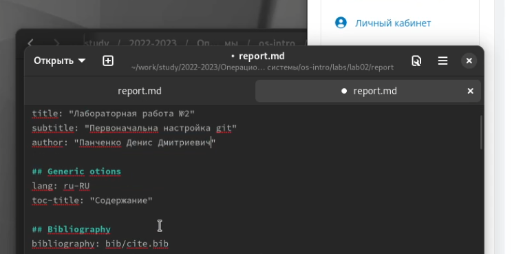
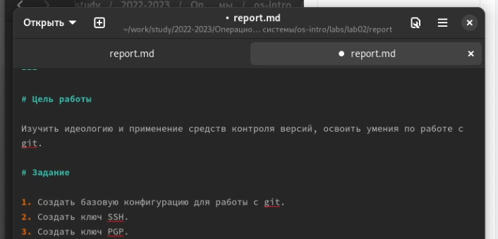
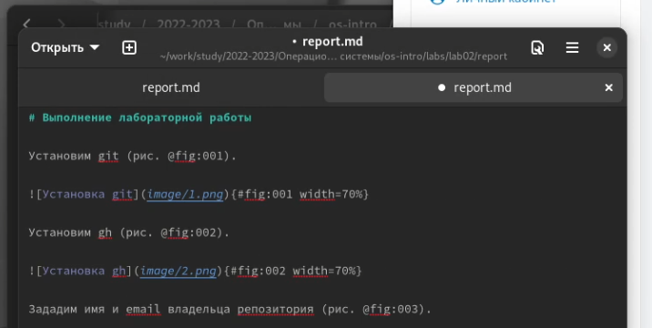
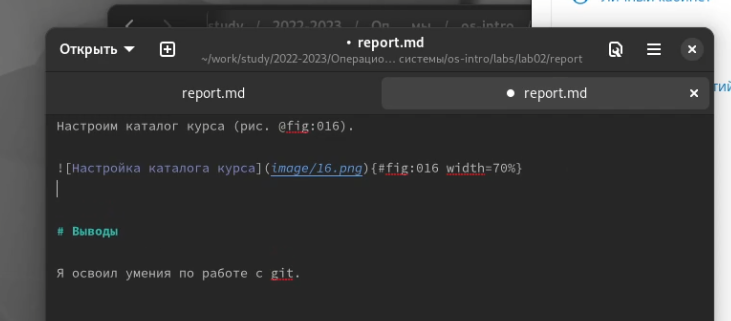
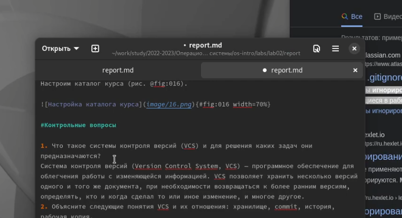
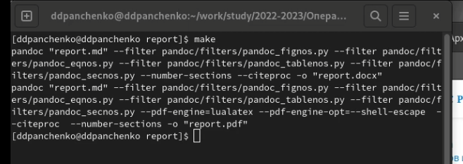
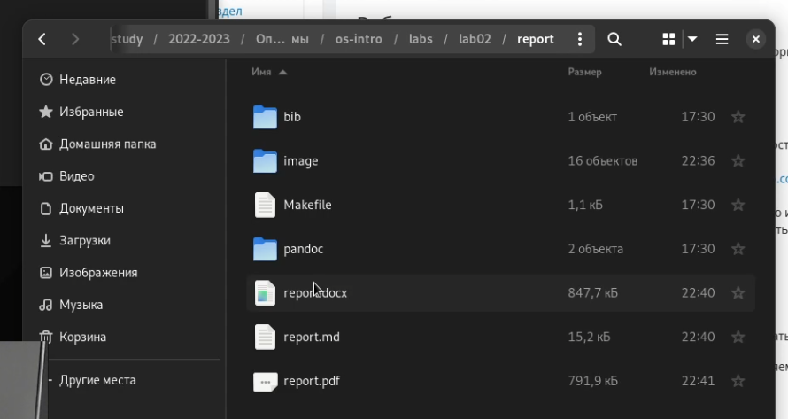

---
## Front matter
lang: ru-RU
title: Лабораторная работа 
subtitle: Markdown
author:
  - Панченко Д. Д.
institute:
  - Российский университет дружбы народов, Москва, Россия
date: 18 февраля 2023

## i18n babel
babel-lang: russian
babel-otherlangs: english

## Formatting pdf
toc: false
toc-title: Содержание
slide_level: 2
aspectratio: 169
section-titles: true
theme: metropolis
header-includes:
 - \metroset{progressbar=frametitle,sectionpage=progressbar,numbering=fraction}
 - '\makeatletter'
 - '\beamer@ignorenonframefalse'
 - '\makeatother'
---

# Информация

## Докладчик

  * Панченко Денис Дмитриевич
  * Студент 1 курса факультета физико-математических наук.
  * Российский университет дружбы народов
  * [derenchikde@gmail.com](mailto:derenchikde@gmail.com)

## Цели и задачи

Научиться оформлять отчёты с помощью легковесного языка разметки Markdown.

## Задание

1. Сделать отчёт по предыдущей лабораторной работе в формате Markdown.
2. В качестве отчёта предоставить отчёты в 3 форматах: pdf, docx и md.

# Выполнение лабораторной работы

## Откроем шаблон для отчета в формате markdown.

{#fig:001 width=70%}

## Записываем цель и задачи работы.

{#fig:002 width=70%}

## Перейдем к записи выполнения лабораторной работы.

{#fig:003 width=70%}

## Напишем вывод.

{#fig:004 width=70%}

## Ответим на контрольные вопросы.

{#fig:005 width=70%}

## Преобразуем наш файл в форматы docx и pdf.

{#fig:006 width=70%}

##

{#fig:007 width=70%}

# Вывод

Я научился оформлять отчёты с помощью легковесного языка разметки Markdown.
