---
## Front matter
lang: ru-RU
title: Лабораторная работа 
subtitle: Основы интерфейса взаимодействия пользователя с системой Unix на уровне командной строки
author:
  - Панченко Д. Д.
institute:
  - Российский университет дружбы народов, Москва, Россия
date: 18 февраля 2023

## i18n babel
babel-lang: russian
babel-otherlangs: english

## Formatting pdf
toc: false
toc-title: Содержание
slide_level: 2
aspectratio: 169
section-titles: true
theme: metropolis
header-includes:
 - \metroset{progressbar=frametitle,sectionpage=progressbar,numbering=fraction}
 - '\makeatletter'
 - '\beamer@ignorenonframefalse'
 - '\makeatother'
---

# Информация

## Докладчик

  * Панченко Денис Дмитриевич
  * Студент 1 курса факультета физико-математических наук.
  * Российский университет дружбы народов
  * [derenchikde@gmail.com](mailto:derenchikde@gmail.com)

## Цели и задачи

Приобрести практические навыки взаимодействия пользователя с системой посредством командной строки.

# Выполнение лабораторной работы

## Определим полное имя нашего домашнего каталога.

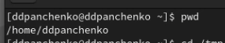{#fig:001 width=70%}

## Перейдем в каталог /tmp.

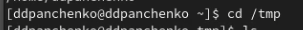{#fig:002 width=70%}

## Выведем на экран содержимое каталога /tmp с разными опциями.

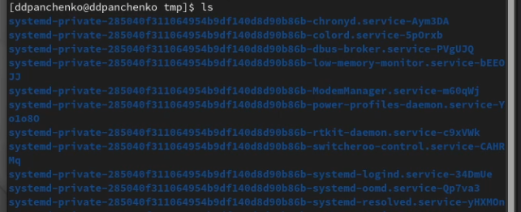{#fig:003 width=70%}

##

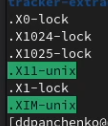{#fig:004 width=70%}

## Определяем, есть ли в каталоге /var/spool подкаталог с именем cron? Такого подкаталога нет.

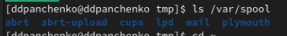{#fig:005 width=70%}

## Перейдем в домашний каталог и выведем на экран его содержимое. Определим, кто является владельцем файлов и подкаталогов?

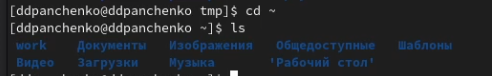{#fig:006 width=70%}

##

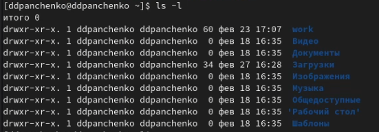{#fig:007 width=70%}

## Создадим новый каталог с именем newdir.

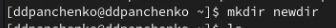{#fig:008 width=70%}

## В каталоге newdir создадим новый каталог с именем morefun.

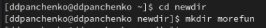{#fig:009 width=70%}

## В домашнем каталоге создадим одной командой три новых каталога с именами letters, memos, misk. Затем удалим эти каталоги одной командой.

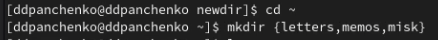{#fig:010 width=70%}

##

{#fig:011 width=70%}

## Удалим каталог newdir командой rm и проверим, был ли каталог удалён.

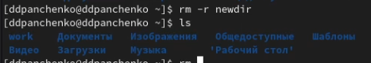{#fig:012 width=70%}

## С помощью команды man определим, какую опцию команды ls нужно использовать для просмотра содержимого не только указанного каталога, но и подкаталогов, входящих в него.

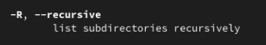{#fig:013 width=70%}

##

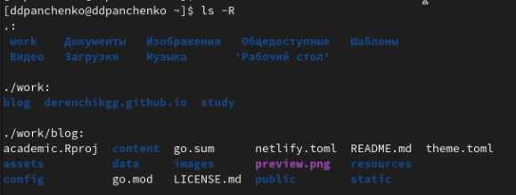{#fig:014 width=70%}

## С помощью команды man определите набор опций команды ls, позволяющий отсорти ровать по времени последнего изменения выводимый список содержимого каталога с развёрнутым описанием файлов.

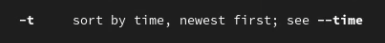{#fig:015 width=70%}

##

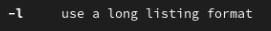{#fig:016 width=70%}

##

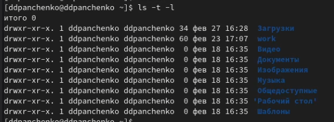{#fig:017 width=70%}

## Используем команду man для просмотра описания следующих команд: cd, pwd, mkdir, rmdir, rm и поясним основные опции этих команд.

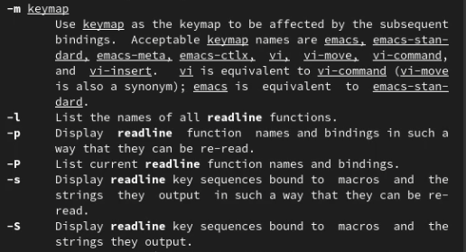{#fig:018 width=70%}

##

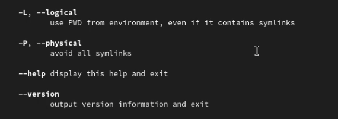{#fig:019 width=70%}

##

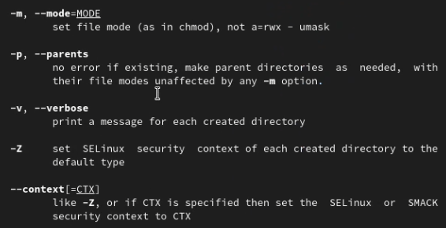{#fig:020 width=70%}

##

{#fig:021 width=70%}

##

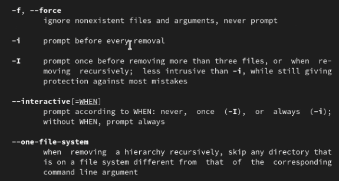{#fig:022 width=70%}

## Используя информацию, полученную при помощи команды history, выполним модификацию и исполнение нескольких команд из буфера команд.

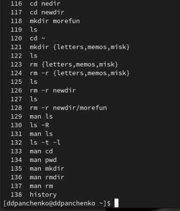{#fig:023 width=70%}

##

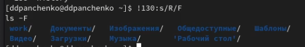{#fig:024 width=70%}

##

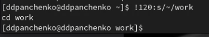{#fig:025 width=70%}

# Вывод

Я приобрел практические навыки взаимодействия пользователя с системой посредством командной строки.
