---
## Front matter
title: "Лабораторная работа №4"
subtitle: "Основы интерфейса взаимодействия пользователя с системой Unix на уровне командной строки"
author: "Панченко Денис Дмитриевич"

## Generic otions
lang: ru-RU
toc-title: "Содержание"

## Bibliography
bibliography: bib/cite.bib
csl: pandoc/csl/gost-r-7-0-5-2008-numeric.csl

## Pdf output format
toc: true # Table of contents
toc-depth: 2
lof: true # List of figures
lot: false # List of tables
fontsize: 12pt
linestretch: 1.5
papersize: a4
documentclass: scrreprt
## I18n polyglossia
polyglossia-lang:
  name: russian
  options:
	- spelling=modern
	- babelshorthands=true
polyglossia-otherlangs:
  name: english
## I18n babel
babel-lang: russian
babel-otherlangs: english
## Fonts
mainfont: PT Serif
romanfont: PT Serif
sansfont: PT Sans
monofont: PT Mono
mainfontoptions: Ligatures=TeX
romanfontoptions: Ligatures=TeX
sansfontoptions: Ligatures=TeX,Scale=MatchLowercase
monofontoptions: Scale=MatchLowercase,Scale=0.9
## Biblatex
biblatex: true
biblio-style: "gost-numeric"
biblatexoptions:
  - parentracker=true
  - backend=biber
  - hyperref=auto
  - language=auto
  - autolang=other*
  - citestyle=gost-numeric
## Pandoc-crossref LaTeX customization
figureTitle: "Рис."
tableTitle: "Таблица"
listingTitle: "Листинг"
lofTitle: "Список иллюстраций"
lotTitle: "Список таблиц"
lolTitle: "Листинги"
## Misc options
indent: true
header-includes:
  - \usepackage{indentfirst}
  - \usepackage{float} # keep figures where there are in the text
  - \floatplacement{figure}{H} # keep figures where there are in the text
---

# Цель работы

Приобретение практических навыков взаимодействия пользователя с системой по-
средством командной строки.

# Выполнение лабораторной работы

Определим полное имя нашего домашнего каталога (рис. @fig:001).

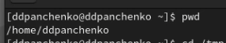{#fig:001 width=70%}

Перейдем в каталог /tmp (рис. @fig:002).

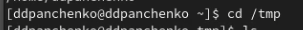{#fig:002 width=70%}

Выведем на экран содержимое каталога /tmp с разными опциями (рис. @fig:003 - @fig:004).

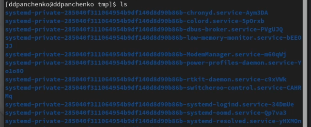{#fig:003 width=70%}

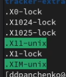{#fig:004 width=70%}

Определяем, есть ли в каталоге /var/spool подкаталог с именем cron (рис. @fig:005)?
Такого подкаталога нет.

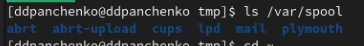{#fig:005 width=70%}

Перейдем в домашний каталог и выведем на экран его содержимое (рис. @fig:006). Определим, кто является владельцем файлов и подкаталогов (рис. @fig:007)?

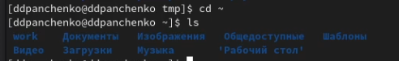{#fig:006 width=70%}

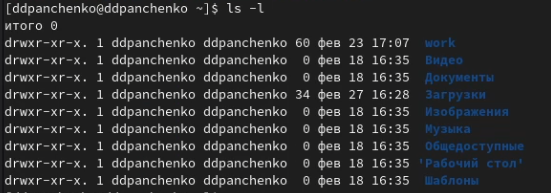{#fig:007 width=70%}

Создадим новый каталог с именем newdir (рис. @fig:008).

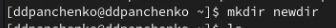{#fig:008 width=70%}

В каталоге newdir создадим новый каталог с именем morefun (рис. @fig:009).

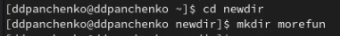{#fig:009 width=70%}

В домашнем каталоге создадим одной командой три новых каталога с именами
letters, memos, misk (рис. @fig:010).
Затем удалим эти каталоги одной командой (рис. @fig:011).

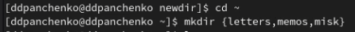{#fig:010 width=70%}

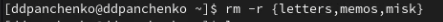{#fig:011 width=70%}

Удалим каталог newdir командой rm и проверим, был ли каталог удалён (рис. @fig:012).

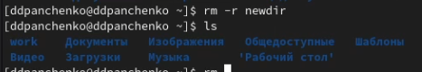{#fig:012 width=70%}

С помощью команды man определим, какую опцию команды ls нужно использовать для просмотра содержимого не только указанного каталога, но и подкаталогов, входящих в него. (рис. @fig:013 - @fig:014).

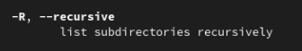{#fig:013 width=70%}

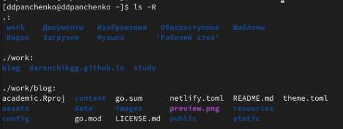{#fig:014 width=70%}

С помощью команды man определите набор опций команды ls, позволяющий отсорти-
ровать по времени последнего изменения выводимый список содержимого каталога
с развёрнутым описанием файлов (рис. @fig:015 - @fig:017).

{#fig:015 width=70%}

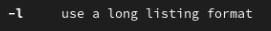{#fig:016 width=70%}

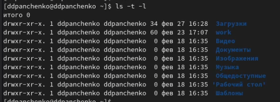{#fig:017 width=70%}

Используем команду man для просмотра описания следующих команд: cd, pwd, mkdir,
rmdir, rm и поясним основные опции этих команд (рис. @fig:018 - @fig:022).

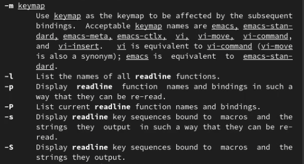{#fig:018 width=70%}

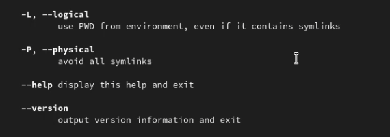{#fig:019 width=70%}

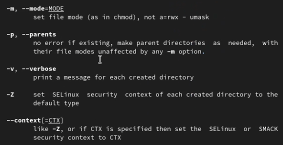{#fig:020 width=70%}

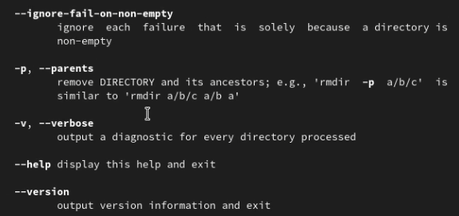{#fig:021 width=70%}

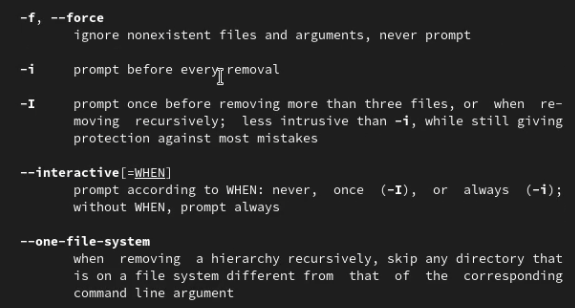{#fig:022 width=70%}

Используя информацию, полученную при помощи команды history, выполним модификацию и исполнение нескольких команд из буфера команд (рис. @fig:023 - @fig:025).

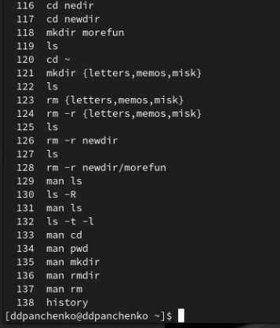{#fig:023 width=70%}

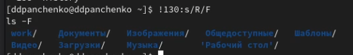{#fig:024 width=70%}

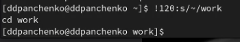{#fig:025 width=70%}

# Вывод

Я приобрел практические навыки взаимодействия пользователя с системой посредством командной строки.

# Контрольные вопросы

1. Что такое командная строка?
Командная строка – это специальная программа, которая позволяет управлять компьютером путем ввода текстовых команд с клавиатуры.
2. При помощи какой команды можно определить абсолютный путь текущего каталога?
При помощи команды pwd.
3. При помощи какой команды и каких опций можно определить только тип файлов
и их имена в текущем каталоге?
При помощи команды ls -F.
4. Каким образом отобразить информацию о скрытых файлах?
При помощи команды ls -a.
5. При помощи каких команд можно удалить файл и каталог? Можно ли это сделать
одной и той же командой?
Файл можно удалить при помощи команды rm, а каталог при помощи команды rmdir. Одной командой это не получится сделать.
6. Каким образом можно вывести информацию о последних выполненных пользователем командах?
При помощи команды history.
7. Как воспользоваться историей команд для их модифицированного выполнения?
При помощи команды !<номер_команды>:s/<что_меняем>/<на_что_меняем>.
8. Приведите примеры запуска нескольких команд в одной строке.
Например, cd; ls.
9. Дайте определение и приведите примеры символов экранирования.
Экранирование символов — замена в тексте управляющих символов на соответствующие текстовые подстановки. Один из видов управляющих последовательностей.
10. Охарактеризуйте вывод информации на экран после выполнения команды ls с опцией l.
Будут отображаться владелец, группа, дата создания.
11. Что такое относительный путь к файлу?
Относительный путь — это путь к файлу относительно текущего каталога.
12. Как получить информацию об интересующей вас команде?
С помощью команды man.
13. Какая клавиша или комбинация клавиш служит для автоматического дополнения
вводимых команд?
С помозью клавиши Tab.

