---
## Front matter
lang: ru-RU
title: Лабораторная работа 
subtitle: Анализ файловой системы Linux. Команды для работы с файлами и каталогами
author:
  - Панченко Д. Д.
institute:
  - Российский университет дружбы народов, Москва, Россия
date: 6 марта 2023

## i18n babel
babel-lang: russian
babel-otherlangs: english

## Formatting pdf
toc: false
toc-title: Содержание
slide_level: 2
aspectratio: 169
section-titles: true
theme: metropolis
header-includes:
 - \metroset{progressbar=frametitle,sectionpage=progressbar,numbering=fraction}
 - '\makeatletter'
 - '\beamer@ignorenonframefalse'
 - '\makeatother'
---

# Информация

## Докладчик

  * Панченко Денис Дмитриевич
  * Студент 1 курса факультета физико-математических наук.
  * Российский университет дружбы народов
  * [derenchikde@gmail.com](mailto:derenchikde@gmail.com)

## Цели и задачи

Ознакомиться с файловой системой Linux, её структурой, именами и содержанием каталогов. Приобрести практические навыки по применению команд для работы с файлами и каталогами, по управлению процессами (и работами), по проверке использования диска и обслуживанию файловой системы.

# Выполнение лабораторной работы

## Скопируем файл /usr/include/sys/io.h в домашний каталог и назовием его equipment.

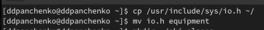{#fig:001 width=70%}

## В домашнем каталоге создайем директорию ~/ski.plases.

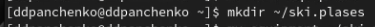{#fig:002 width=70%}

## Переместим файл equipment в каталог ~/ski.plases.

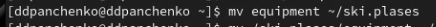{#fig:003 width=70%}

## Переименуем файл ~/ski.plases/equipment в ~/ski.plases/equiplist.

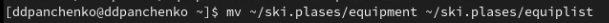{#fig:004 width=70%}

## Создадим в домашнем каталоге файл abc1 и скопируем его в каталог ~/ski.plases, назвав equiplist2.

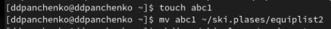{#fig:005 width=70%}

## Создадим каталог с именем equipment в каталоге ~/ski.plases.

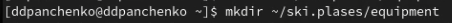{#fig:006 width=70%}

## Переместите файлы ~/ski.plases/equiplist и equiplist2 в каталог ~/ski.plases/equipment.

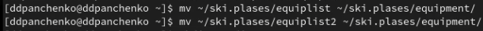{#fig:007 width=70%}

## Создадим и переместим каталог ~/newdir в каталог ~/ski.plases и назовем его plans.

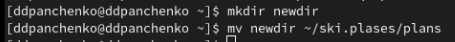{#fig:008 width=70%}

## Присваиваем определенным файлам определенные права доступа.

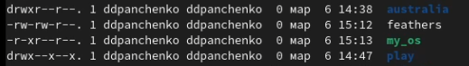{#fig:009 width=70%}

## Скопируем файл ~/feathers в файл ~/file.old.

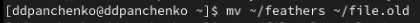{#fig:010 width=70%}

## Переместим файл ~/file.old в каталог ~/play.

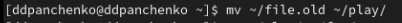{#fig:011 width=70%}

## Скопируем каталог ~/play в каталог ~/fun.

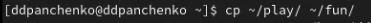{#fig:012 width=70%}

## Переместим каталог ~/fun в каталог ~/play и назовем его games.

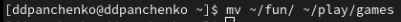{#fig:013 width=70%}

## Лишим владельца файла ~/feathers права на чтение.

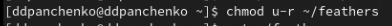{#fig:014 width=70%}

## Что произойдёт, если вы попытаетесь просмотреть файл ~/feathers командой cat? Будет отказано в доступе.

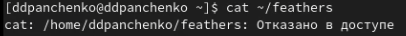{#fig:015 width=70%}

## Вернем владельцу файла ~/feathers право на чтение.

{#fig:016 width=70%}

## Лишим владельца каталога ~/play права на выполнение.

{#fig:017 width=70%}

## Перейдем в каталог ~/play. Что произошло? Нам отказано в доступе.

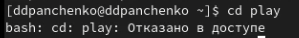{#fig:018 width=70%}

## Вернем владельцу каталога ~/play право на выполнение.

{#fig:019 width=70%}

## Используем команду man для просмотра описания следующих команд: mount, fsck, mkfs, kill.

## mount применяется для монтирования файловых систем.

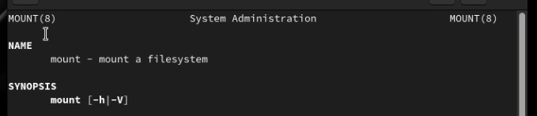{#fig:020 width=70%}

## fsck восстанавливает поврежденную файловую систему или проверяет ее на целостность.

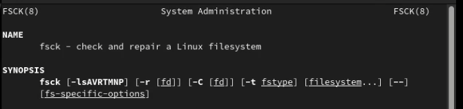{#fig:021 width=70%}

## mkfs создает новую файловую систему.

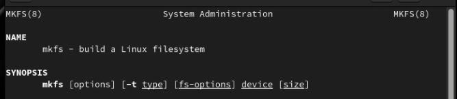{#fig:022 width=70%}

## kill используется для принудительного завершения работы приложений.

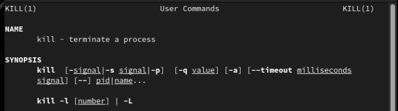{#fig:023 width=70%}

# Вывод

Я ознакомился с файловой системой Linux, её структурой, именами и содержанием каталогов. Приобрел практические навыки по применению команд для работы с файлами и каталогами, по управлению процессами (и работами), по проверке использования диска и обслуживанию файловой системы.
