---
## Front matter
lang: ru-RU
title: Лабораторная работа 
subtitle: Поиск файлов. Перенаправление ввода-вывода. Просмотр запущенных процессов
author:
  - Панченко Д. Д.
institute:
  - Российский университет дружбы народов, Москва, Россия
date: 13 марта 2023

## i18n babel
babel-lang: russian
babel-otherlangs: english

## Formatting pdf
toc: false
toc-title: Содержание
slide_level: 2
aspectratio: 169
section-titles: true
theme: metropolis
header-includes:
 - \metroset{progressbar=frametitle,sectionpage=progressbar,numbering=fraction}
 - '\makeatletter'
 - '\beamer@ignorenonframefalse'
 - '\makeatother'
---

# Информация

## Докладчик

  * Панченко Денис Дмитриевич
  * Студент 1 курса факультета физико-математических наук.
  * Российский университет дружбы народов
  * [derenchikde@gmail.com](mailto:derenchikde@gmail.com)

## Цели и задачи

Ознакомиться с инструментами поиска файлов и фильтрации текстовых данных. Приобрести практические навыки: по управлению процессами, по проверке использования диска и обслуживанию файловых систем.

# Выполнение лабораторной работы

## Запишем в файл file.txt названия файлов, содержащихся в каталоге /etc, а также названия файлов, содержащихся в домашнем каталоге.

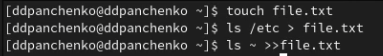{#fig:001 width=70%}

## Выведем имена всех файлов, имеющих расширение .conf, после чего запишем их в новый текстовой файл conf.txt.

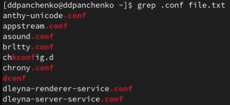{#fig:002 width=70%}

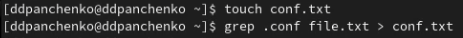{#fig:003 width=70%}

## Определим, какие файлы в домашнем каталоге имеют имена, начинавшиеся с символа c.

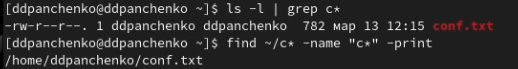{#fig:004 width=70%}

## Выведем на экран имена файлов из каталога /etc, начинающиеся с символа h.

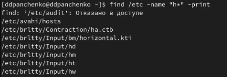{#fig:005 width=70%}

## Запустим в фоновом режиме процесс, который будет записывать в файл ~/logfile файлы, имена которых начинаются с log.

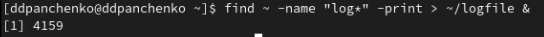{#fig:006 width=70%}

## Удалим файл ~/logfile.

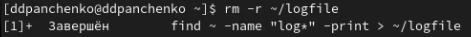{#fig:007 width=70%}

## Запустим в консоли в фоновом режиме редактор gedit.

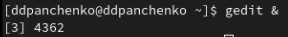{#fig:008 width=70%}

## Определим идентификатор процесса gedit, используя команду ps, конвейер и фильтр grep.

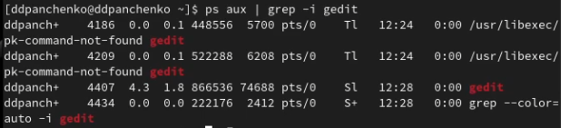{#fig:009 width=70%}

## Прочтем справку команды kill, после чего используем её для завершения процесса gedit.

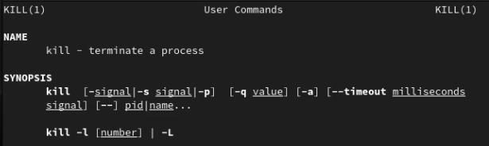{#fig:010 width=70%}

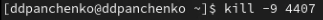{#fig:011 width=70%}

## Выполним команды df и du, предварительно получив более подробную информацию об этих командах.

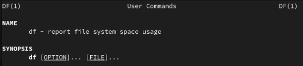{#fig:012 width=70%}

##

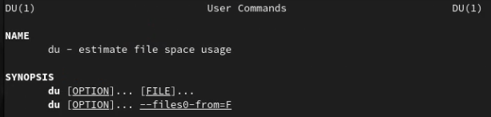{#fig:013 width=70%}

##

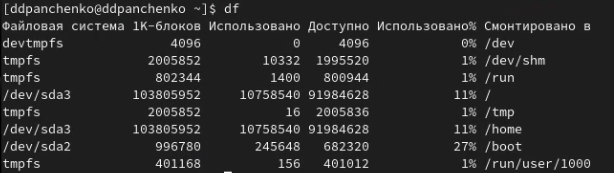{#fig:014 width=70%}

## 

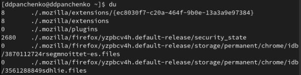{#fig:015 width=70%}

## Воспользовавшись командой find, выведем имена всех директорий, имеющихся в домашнем каталоге.

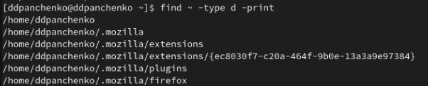{#fig:016 width=70%}

# Вывод

Я ознакомился с инструментами поиска файлов и фильтрации текстовых данных. Приобрел практические навыки: по управлению процессами, по проверке использования диска и обслуживанию файловых систем.
