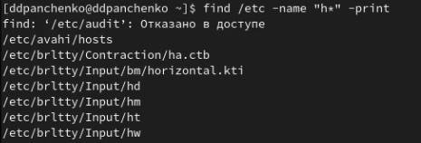

---
## Front matter
title: "Лабораторная работа №6"
subtitle: "Поиск файлов. Перенаправление ввода-вывода. Просмотр запущенных процессов"
author: "Панченко Денис Дмитриевич"

## Generic otions
lang: ru-RU
toc-title: "Содержание"

## Bibliography
bibliography: bib/cite.bib
csl: pandoc/csl/gost-r-7-0-5-2008-numeric.csl

## Pdf output format
toc: true # Table of contents
toc-depth: 2
lof: true # List of figures
lot: false # List of tables
fontsize: 12pt
linestretch: 1.5
papersize: a4
documentclass: scrreprt
## I18n polyglossia
polyglossia-lang:
  name: russian
  options:
	- spelling=modern
	- babelshorthands=true
polyglossia-otherlangs:
  name: english
## I18n babel
babel-lang: russian
babel-otherlangs: english
## Fonts
mainfont: PT Serif
romanfont: PT Serif
sansfont: PT Sans
monofont: PT Mono
mainfontoptions: Ligatures=TeX
romanfontoptions: Ligatures=TeX
sansfontoptions: Ligatures=TeX,Scale=MatchLowercase
monofontoptions: Scale=MatchLowercase,Scale=0.9
## Biblatex
biblatex: true
biblio-style: "gost-numeric"
biblatexoptions:
  - parentracker=true
  - backend=biber
  - hyperref=auto
  - language=auto
  - autolang=other*
  - citestyle=gost-numeric
## Pandoc-crossref LaTeX customization
figureTitle: "Рис."
tableTitle: "Таблица"
listingTitle: "Листинг"
lofTitle: "Список иллюстраций"
lotTitle: "Список таблиц"
lolTitle: "Листинги"
## Misc options
indent: true
header-includes:
  - \usepackage{indentfirst}
  - \usepackage{float} # keep figures where there are in the text
  - \floatplacement{figure}{H} # keep figures where there are in the text
---

# Цель работы

Ознакомление с инструментами поиска файлов и фильтрации текстовых данных. Приобретение практических навыков: по управлению процессами (и заданиями), по проверке использования диска и обслуживанию файловых систем.

# Выполнение лабораторной работы

Запишем в файл file.txt названия файлов, содержащихся в каталоге /etc, а также названия файлов, содержащихся в домашнем каталоге (рис. @fig:001).

{#fig:001 width=70%}

Выведем имена всех файлов, имеющих расширение .conf, после чего
запишим их в новый текстовой файл conf.txt (рис. @fig:002 - @fig:003).

{#fig:002 width=70%}

{#fig:003 width=70%}

Определим, какие файлы в домашнем каталоге имеют имена, начинавшиеся с символа c (рис. @fig:004).

{#fig:004 width=70%}

Выведем на экран имена файлов из каталога /etc, начинающиеся с символа h (рис. @fig:005).

{#fig:005 width=70%}

Запустим в фоновом режиме процесс, который будет записывать в файл ~/logfile файлы, имена которых начинаются с log (рис. @fig:006).

{#fig:006 width=70%}

Удалим файл ~/logfile (рис. @fig:007).

{#fig:007 width=70%}

Запустим в консоли в фоновом режиме редактор gedit (рис. @fig:008).

{#fig:008 width=70%}

Определим идентификатор процесса gedit, используя команду ps, конвейер и фильтр grep (рис. @fig:009).

{#fig:009 width=70%}

Прочтем справку команды kill, после чего используем её для завершения процесса gedit (рис. @fig:010 - @fig:011).

{#fig:010 width=70%}

{#fig:011 width=70%}

Выполним команды df и du, предварительно получив более подробную информацию об этих командах (рис. @fig:012 - @fig:015).

{#fig:012 width=70%}

{#fig:013 width=70%}

{#fig:014 width=70%}

{#fig:015 width=70%}

Воспользовавшись командой find, выведем имена всех директорий, имеющихся в домашнем каталоге (рис. @fig:016).

{#fig:016 width=70%}

# Вывод

Я ознакомился с инструментами поиска файлов и фильтрации текстовых данных. Приобрел практические навыки: по управлению процессами, по проверке использования диска и обслуживанию файловых систем.

# Контрольные вопросы

1. Какие потоки ввода вывода вы знаете?
В системе по умолчанию открыто три специальных потока:
- stdin — стандартный поток ввода (по умолчанию: клавиатура), файловый дескриптор 0;
- stdout — стандартный поток вывода (по умолчанию: консоль), файловый дескриптор 1;
- stderr — стандартный поток вывод сообщений об ошибках (по умолчанию: консоль), файловый дескриптор 2.

2. Объясните разницу между операцией > и >>.
> - перенаправление вывода (stdout) в файл.
>> - перенаправление вывода (stdout) в файл в режиме добавления.

3. Что такое конвейер?
Конвейер (pipe) служит для объединения простых команд или утилит в цепочки, в которых результат работы предыдущей команды передаётся последующей.

4. Что такое процесс? Чем это понятие отличается от программы?
Процесс — это идентифицируемая абстракция совокупности взаимосвязанных системных ресурсов на основе отдельного и независимого виртуального адресного пространства в контексте которой организуется выполнение потоков.

5. Что такое PID и GID?
PID — идентификатор процесса.
GIF - идентификатор группы.

6. Что такое задачи и какая команда позволяет ими управлять?
Запущенные фоном программы называются задачами. Ими можно управлять с помощью команды jobs, которая выводит список запущенных в данный момент задач.

7. Найдите информацию об утилитах top и htop. Каковы их функции?
top - интерактивный просмотрщик процессов. htop аналог top. Программа top динамически выводит в режиме реального времени информации о работающей системе, т.е. о фактической активности процессов. По умолчанию она выдает задачи, наиболее загружающие процессор сервера, и обновляет список каждые две секунды. 

8. Назовите и дайте характеристику команде поиска файлов. Приведите примеры использования этой команды.
Команда find используется для поиска и отображения на экран имён файлов, соответствующих заданной строке символов. Например, вывести на экран имена файлов из вашего домашнего каталога и его подкаталогов, начинающихся на f: find ~ -name "f*" -print

9. Можно ли по контексту найти файл? Если да, то как?
Для поиска файла по содержимому проще всего воспользоваться командой grep. Например: grep -r строка_поиска каталог.

10. Как определить объем свободной памяти на жёстком диске?
Команда df показывает доступное и используемое дисковое пространство в системе Linux.

11. Как определить объем вашего домашнего каталога?
Для просмотра размеров папок на диске используется команда du.

12. Как удалить зависший процесс?
Для завершения процесса нужно вызвать утилиту kill с параметром "-9".
