---
## Front matter
lang: ru-RU
title: Лабораторная работа 
subtitle: Командная оболочка Midnight Commander
author:
  - Панченко Д. Д.
institute:
  - Российский университет дружбы народов, Москва, Россия
date: 20 марта 2023

## i18n babel
babel-lang: russian
babel-otherlangs: english

## Formatting pdf
toc: false
toc-title: Содержание
slide_level: 2
aspectratio: 169
section-titles: true
theme: metropolis
header-includes:
 - \metroset{progressbar=frametitle,sectionpage=progressbar,numbering=fraction}
 - '\makeatletter'
 - '\beamer@ignorenonframefalse'
 - '\makeatother'
---

# Информация

## Докладчик

  * Панченко Денис Дмитриевич
  * Студент 1 курса факультета физико-математических наук.
  * Российский университет дружбы народов
  * [derenchikde@gmail.com](mailto:derenchikde@gmail.com)

## Цели и задачи

Освоение основных возможностей командной оболочки Midnight Commander. Приобретение навыков практической работы по просмотру каталогов и файлов; манипуляций с ними.

# Выполнение лабораторной работы

# Задание по mc

## Изучим информацию о mc.

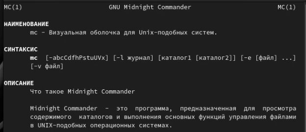{#fig:001 width=70%}

## Запустим из командной строки mc.

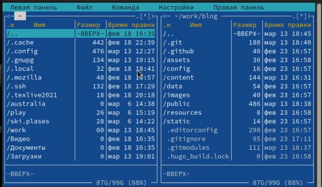{#fig:002 width=70%}

## Выполним несколько операций в mc.

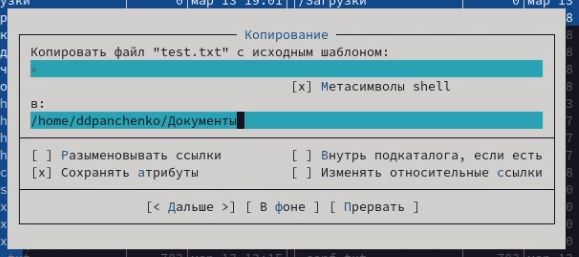{#fig:003 width=70%}

## 

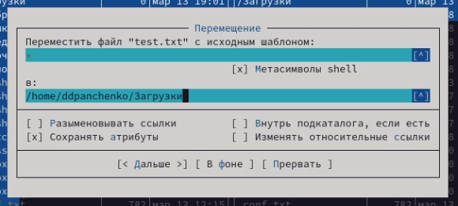{#fig:004 width=70%}

## 

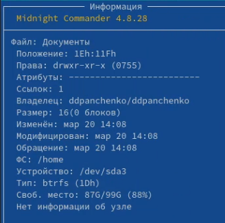{#fig:005 width=70%}

## Выполним: просмотр содержимого текстового файла; редактирование содержимого текстового файла; создание каталога; копирование файлов в созданный каталог.

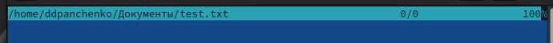{#fig:006 width=70%}

## 

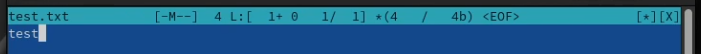{#fig:007 width=70%}

## 

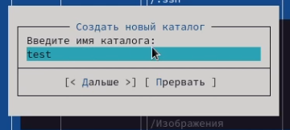{#fig:008 width=70%}

## 

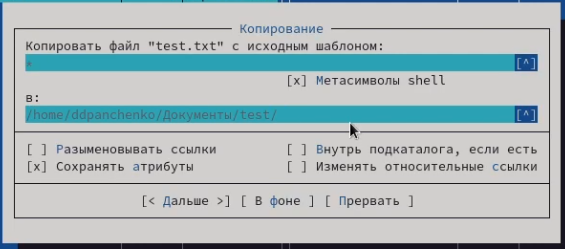{#fig:009 width=70%}

## Осуществите: поиск в файловой системе файла с заданными условиями; переход в домашний каталог;

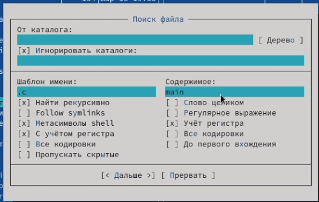{#fig:010 width=70%}

## 

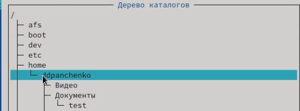{#fig:011 width=70%}

## Освоим операции, определяющие структуру экрана mc.

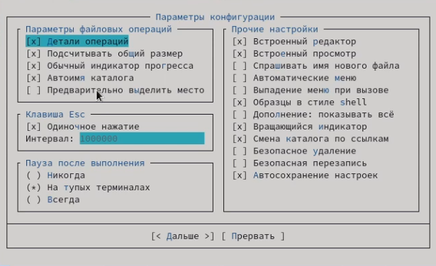{#fig:012 width=70%}

# Задание по встроенному редактору mc

## Создадим текстовой файл text.txt.

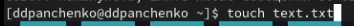{#fig:013 width=70%}

## Откроем этот файл с помощью встроенного в mc редактора и вставим небольшой фрагмент текста.

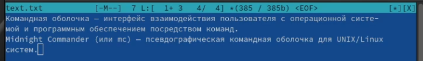{#fig:014 width=70%}

## Проделаем с текстом следующие манипуляции: удалим строку текста; выделим фрагмент текста и скопируем его на новую строку; добавим текст в начале и конце файла; сохраним и закроем файл.

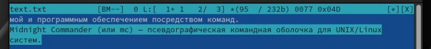{#fig:015 width=70%}

## 

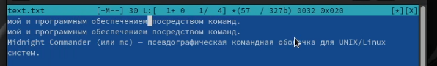{#fig:016 width=70%}

## 

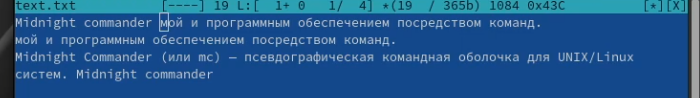{#fig:017 width=70%}

## 

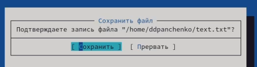{#fig:018 width=70%}

## Включим подсветку синтаксиса.

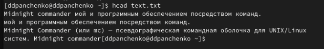{#fig:019 width=70%}

# Вывод

Я освоил основные возможности командной оболочки Midnight Commander. Приобрел навыки практической работы по просмотру каталогов и файлов; манипуляций с ними.
