---
## Front matter
title: "Лабораторная работа №7"
subtitle: "Командная оболочка Midnight Commander"
author: "Панченко Денис Дмитриевич"

## Generic otions
lang: ru-RU
toc-title: "Содержание"

## Bibliography
bibliography: bib/cite.bib
csl: pandoc/csl/gost-r-7-0-5-2008-numeric.csl

## Pdf output format
toc: true # Table of contents
toc-depth: 2
lof: true # List of figures
lot: false # List of tables
fontsize: 12pt
linestretch: 1.5
papersize: a4
documentclass: scrreprt
## I18n polyglossia
polyglossia-lang:
  name: russian
  options:
	- spelling=modern
	- babelshorthands=true
polyglossia-otherlangs:
  name: english
## I18n babel
babel-lang: russian
babel-otherlangs: english
## Fonts
mainfont: PT Serif
romanfont: PT Serif
sansfont: PT Sans
monofont: PT Mono
mainfontoptions: Ligatures=TeX
romanfontoptions: Ligatures=TeX
sansfontoptions: Ligatures=TeX,Scale=MatchLowercase
monofontoptions: Scale=MatchLowercase,Scale=0.9
## Biblatex
biblatex: true
biblio-style: "gost-numeric"
biblatexoptions:
  - parentracker=true
  - backend=biber
  - hyperref=auto
  - language=auto
  - autolang=other*
  - citestyle=gost-numeric
## Pandoc-crossref LaTeX customization
figureTitle: "Рис."
tableTitle: "Таблица"
listingTitle: "Листинг"
lofTitle: "Список иллюстраций"
lotTitle: "Список таблиц"
lolTitle: "Листинги"
## Misc options
indent: true
header-includes:
  - \usepackage{indentfirst}
  - \usepackage{float} # keep figures where there are in the text
  - \floatplacement{figure}{H} # keep figures where there are in the text
---

# Цель работы

Освоение основных возможностей командной оболочки Midnight Commander. Приобретение навыков практической работы по просмотру каталогов и файлов; манипуляций с ними.

# Выполнение лабораторной работы

## Задание по mc

Изучим информацию о mc(рис. @fig:001).

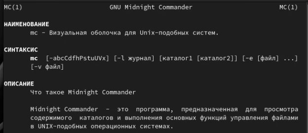{#fig:001 width=70%}

Запустим из командной строки mc (рис. @fig:002).

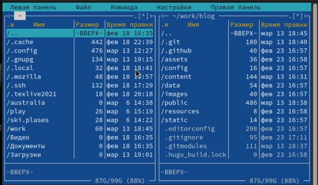{#fig:002 width=70%}

Выполним несколько операций в mc (рис. @fig:003 - @fig:005).

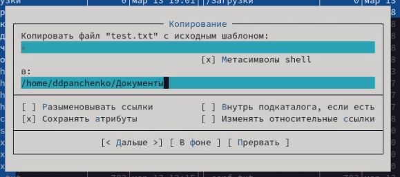{#fig:003 width=70%}

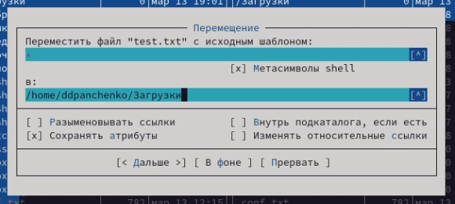{#fig:004 width=70%}

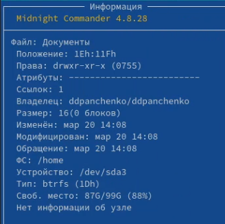{#fig:005 width=70%}

Выполним: просмотр содержимого текстового файла (рис. @fig:006); редактирование содержимого текстового файла (рис. @fig:007); создание каталога (рис. @fig:008); копирование файлов в созданный каталог (рис. @fig:009).

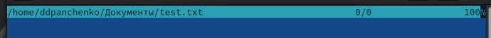{#fig:006 width=70%}

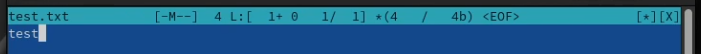{#fig:007 width=70%}

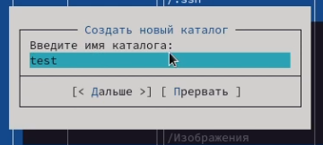{#fig:008 width=70%}

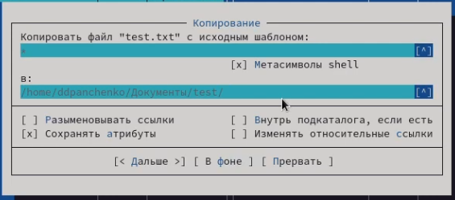{#fig:009 width=70%}

Осуществите: поиск в файловой системе файла с заданными условиями (рис. @fig:010); переход в домашний каталог (рис. @fig:011);

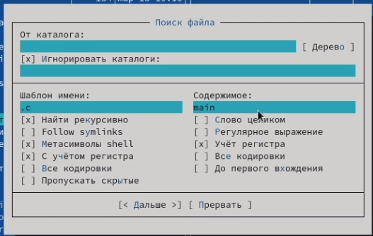{#fig:010 width=70%}

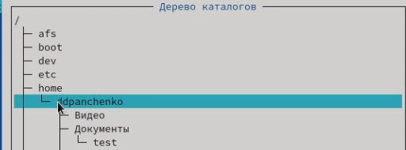{#fig:011 width=70%}

Освоим операции, определяющие структуру экрана mc (рис. @fig:012).

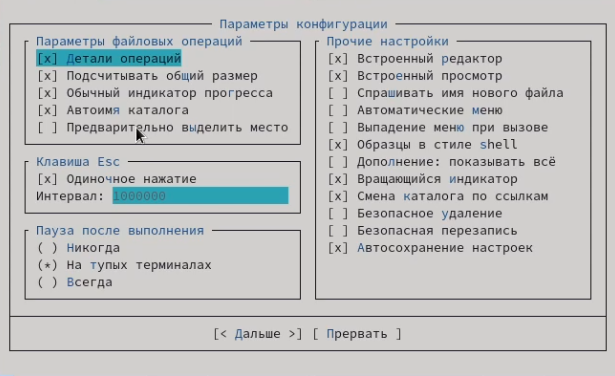{#fig:012 width=70%}

## Задание по встроенному редактору mc

Создадим текстовой файл text.txt (рис. @fig:013).

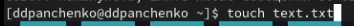{#fig:013 width=70%}

Откроем этот файл с помощью встроенного в mc редактора и вставим небольшой фрагмент текста (рис. @fig:014).

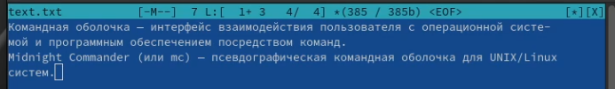{#fig:014 width=70%}

Проделаем с текстом следующие манипуляции: удалим строку текста (рис. @fig:015); выделим фрагмент текста и скопируем его на новую строку (рис. @fig:016); добавим текст в начале и конце файла (рис. @fig:017); сохраним и закроем файл (рис. @fig:018).

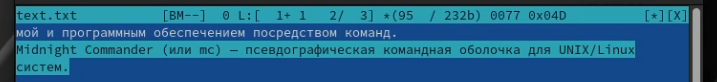{#fig:015 width=70%}

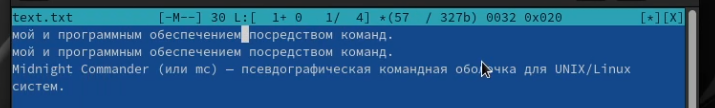{#fig:016 width=70%}

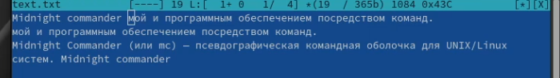{#fig:017 width=70%}

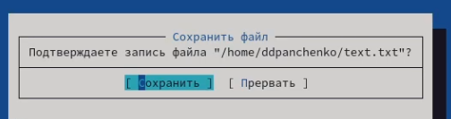{#fig:018 width=70%}

Включим подсветку синтаксиса (рис. @fig:019).

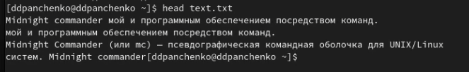{#fig:019 width=70%}

# Вывод

Я освоил основные возможности командной оболочки Midnight Commander. Приобрел навыки практической работы по просмотру каталогов и файлов; манипуляций с ними.

# Контрольные вопросы

1. Какие режимы работы есть в mc. Охарактеризуйте их.
Существует четыре режима: Full, Brief, Long и User. В режиме Full отображается имя файла, размер файла и время последней модификации. В режиме Brief список файлов располагается в две колонки и состоит только из имён файлов (поэтому в этом режиме отображается наибольшее количество файлов, по сравнению с другими режимами). Режим Long идентичен результату выполнения команды ls -l. В этом режиме панель занимает весь экран. При использовании режима User нужно указать параметр формата отображения.

2. Какие операции с файлами можно выполнить как с помощью команд shell, так и с помощью меню (комбинаций клавиш) mc? Приведите несколько примеров.
Для управления файловой системой и вообще для работы с файлами можно использовать такие команды ОС, как pwd, ls, cd, mv, mkdir, rmdir, cp, rm, cat, more и т.д.

3. Опишите структура меню левой (или правой) панели mc, дайте характеристику командам.
В меню каждой (левой или правой) панели можно выбрать Формат списка:
- стандартный — выводит список файлов и каталогов с указанием размера и времени правки;
- ускоренный — позволяет задать число столбцов, на которые разбивается панель при выводе списка имён файлов или каталогов без дополнительной информации;
- расширенный — помимо названия файла или каталога выводит сведения о правах доступа, владельце, группе, размере, времени правки;
- определённый пользователем — позволяет вывести те сведения о файле или каталоге, которые задаст сам пользователь.

4. Опишите структура меню Файл mc, дайте характеристику командам.
Команды меню Файл :
- Просмотр (F3) — позволяет посмотреть содержимое текущего (или выделенного) файла без возможности редактирования.
- Просмотр вывода команды (М + !) — функция запроса команды с параметрами (аргумент к текущему выбранному файлу).
- Правка (F4) — открывает текущий (или выделенный) файл для его редактирования.
- Копирование (F5) — осуществляет копирование одного или нескольких файлов или каталогов в указанное пользователем во всплывающем окне место.
- Права доступа (Ctrl-x c) — позволяет указать (изменить) права доступа к одному или нескольким файлам или каталогам.
- Жёсткая ссылка (Ctrl-x l) — позволяет создать жёсткую ссылку к текущему (или выделенному) файлу.
- Символическая ссылка (Ctrl-x s) — позволяет создать символическую ссылку к текущему (или выделенному) файлу2.
- Владелец/группа (Ctrl-x o) — позволяет задать (изменить) владельца и имя группы для одного или нескольких файлов или каталогов.
- Права (расширенные) — позволяет изменить права доступа и владения для одного или нескольких файлов или каталогов.
- Переименование (F6) — позволяет переименовать (или переместить) один или несколько файлов или каталогов.
- Создание каталога (F7) — позволяет создать каталог.
- Удалить (F8) — позволяет удалить один или несколько файлов или каталогов.
- Выход (F10) — завершает работу mc.

5. Опишите структуру меню Команда mc, дайте характеристику командам.
В меню Команда содержатся более общие команды для работы с mc.
Команды меню Команда:
- Дерево каталогов — отображает структуру каталогов системы.
- Поиск файла — выполняет поиск файлов по заданным параметрам.
- Переставить панели — меняет местами левую и правую панели.
- Сравнить каталоги (Ctrl-x d) — сравнивает содержимое двух каталогов.
- Размеры каталогов — отображает размер и время изменения каталога (по умолчанию в mc размер каталога корректно не отображается).
- История командной строки — выводит на экран список ранее выполненных в оболочке команд.
- Каталоги быстрого доступа (Ctrl) — пр вызове выполняется быстрая смена текущего каталога на один из заданного списка.
- Восстановление файлов — позволяет восстановить файлы на файловых системах ext2 и ext3.
- Редактировать файл расширений — позволяет задать с помощью определённого синтаксиса действия при запуске файлов с определённым расширением (например, какое программного обеспечение запускать для открытия или редактирования файлов с расширением doc или docx).
- Редактировать файл меню — позволяет отредактировать контекстное меню пользователя, вызываемое по клавише F2 .
- Редактировать файл расцветки имён — позволяет подобрать оптимальную для пользователя расцветку имён файлов в зависимости от их типа.

6. Опишите структуру меню Настройки mc, дайте характеристику командам.
Меню Настройки содержит ряд дополнительных опций по внешнему виду и функциональности mc.
Меню Настройки содержит:
- Конфигурация — позволяет скорректировать настройки работы с панелями.
- Внешний вид и Настройки панелей — определяет элементы (строка меню, командная строка, подсказки и прочее), отображаемые при вызове mc, а также геометрию расположения панелей и цветовыделение.
- Биты символов — задаёт формат обработки информации локальным терминалом.
- Подтверждение — позволяет установить или убрать вывод окна с запросом подтверждения действий при операциях удаления и перезаписи файлов, а также при выходе из программы.
- Распознание клавиш — диалоговое окно используется для тестирования функциональных клавиш, клавиш управления курсором и прочее.
- Виртуальные ФС –– настройки виртуальной файловой системы: тайм-аут, пароль и прочее.

8. Назовите и дайте характеристику командам встроенного редактора mc.
F1 - вызов контекстно-зависимой подсказки
F2 - вызов пользовательского меню с возможностью создания и/или дополнения дополнительных функций
F3 - просмотр содержимого файла, на который указывает подсветка в активной панели (без возможности редактирования)
F4 - вызов встроенного в mc редактора для изменения содержания файла, на который указывает подсветка в активной панели
F5 - копирование одного или нескольких файлов, отмеченных в первой (активной) панели, в каталог, отображаемый на второй панели
F6 - перенос одного или нескольких файлов, отмеченных в первой (активной) панели, в каталог, отображаемый на второй панели
F7 - создание подкаталога в каталоге, отображаемом в активной панели
F8 - удаление одного или нескольких файлов (каталогов), отмеченных в первой (активной) панели файлов
F9 - вызов меню mc
F10 - выход из mc
