---
## Front matter
lang: ru-RU
title: Лабораторная работа 
subtitle: Текстовой редактор vi
author:
  - Панченко Д. Д.
institute:
  - Российский университет дружбы народов, Москва, Россия
date: 20 марта 2023

## i18n babel
babel-lang: russian
babel-otherlangs: english

## Formatting pdf
toc: false
toc-title: Содержание
slide_level: 2
aspectratio: 169
section-titles: true
theme: metropolis
header-includes:
 - \metroset{progressbar=frametitle,sectionpage=progressbar,numbering=fraction}
 - '\makeatletter'
 - '\beamer@ignorenonframefalse'
 - '\makeatother'
---

# Информация

## Докладчик

  * Панченко Денис Дмитриевич
  * Студент 1 курса факультета физико-математических наук.
  * Российский университет дружбы народов
  * [derenchikde@gmail.com](mailto:derenchikde@gmail.com)

## Цели и задачи

Получить практические навыки работы с редактором vi.

# Выполнение лабораторной работы

# Задание 1

## Создадим каталог с именем ~/work/os/lab08.

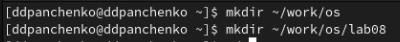{#fig:001 width=70%}

## Перейдем в созданный каталог.

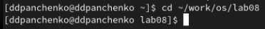{#fig:002 width=70%}

## Вызовем vi и создадим файл hello.sh.

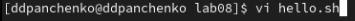{#fig:003 width=70%}

## Нажмем клавишу i и введем следующий текст.

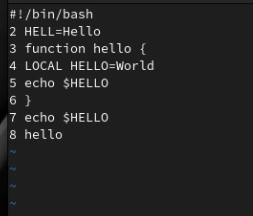{#fig:004 width=70%}

## Нажмем клавишу Esc для перехода в командный режим, нажмем : для перехода в режим последней строки и нажмем w и q, а затем нажмем клавишу Enter для сохранения текста и завершения работы.

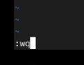{#fig:005 width=70%}

## Сделаем файл исполняемым.

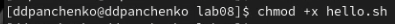{#fig:006 width=70%}

# Задание 2

## Вызовем vi на редактирование файла.

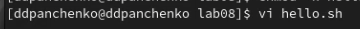{#fig:007 width=70%}

## Заменим слово HELL на HELLO.

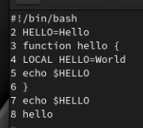{#fig:008 width=70%}

## Заменим слово LOCAL на local.

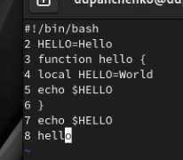{#fig:009 width=70%}

## Вставим в конец следующий текст: echo $HELLO.

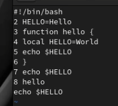{#fig:010 width=70%}

## Удалим последнюю строку.

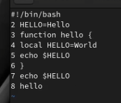{#fig:011 width=70%}

## Введем команду отмены изменений u для отмены последней команды.

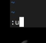{#fig:012 width=70%}

## 

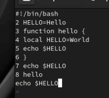{#fig:013 width=70%}

## Введем символ : для перехода в режим последней строки. Запишем произведённые изменения и выйдем из vi.

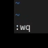{#fig:014 width=70%}

# Вывод

Я получил практические навыки работы с редактором vi.
