---
## Front matter
title: "Лабораторная работа №8"
subtitle: "Текстовой редактор vi"
author: "Панченко Денис Дмитриевич"

## Generic otions
lang: ru-RU
toc-title: "Содержание"

## Bibliography
bibliography: bib/cite.bib
csl: pandoc/csl/gost-r-7-0-5-2008-numeric.csl

## Pdf output format
toc: true # Table of contents
toc-depth: 2
lof: true # List of figures
lot: false # List of tables
fontsize: 12pt
linestretch: 1.5
papersize: a4
documentclass: scrreprt
## I18n polyglossia
polyglossia-lang:
  name: russian
  options:
	- spelling=modern
	- babelshorthands=true
polyglossia-otherlangs:
  name: english
## I18n babel
babel-lang: russian
babel-otherlangs: english
## Fonts
mainfont: PT Serif
romanfont: PT Serif
sansfont: PT Sans
monofont: PT Mono
mainfontoptions: Ligatures=TeX
romanfontoptions: Ligatures=TeX
sansfontoptions: Ligatures=TeX,Scale=MatchLowercase
monofontoptions: Scale=MatchLowercase,Scale=0.9
## Biblatex
biblatex: true
biblio-style: "gost-numeric"
biblatexoptions:
  - parentracker=true
  - backend=biber
  - hyperref=auto
  - language=auto
  - autolang=other*
  - citestyle=gost-numeric
## Pandoc-crossref LaTeX customization
figureTitle: "Рис."
tableTitle: "Таблица"
listingTitle: "Листинг"
lofTitle: "Список иллюстраций"
lotTitle: "Список таблиц"
lolTitle: "Листинги"
## Misc options
indent: true
header-includes:
  - \usepackage{indentfirst}
  - \usepackage{float} # keep figures where there are in the text
  - \floatplacement{figure}{H} # keep figures where there are in the text
---

# Цель работы

Получить практические навыки работы с редактором vi.

# Выполнение лабораторной работы

## Задание 1

Создадим каталог с именем ~/work/os/lab08 (рис. @fig:001).

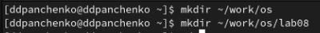{#fig:001 width=70%}

Перейдем в созданный каталог (рис. @fig:002).

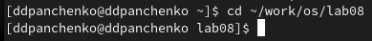{#fig:002 width=70%}

Вызовем vi и создадим файл hello.sh (рис. @fig:003).

{#fig:003 width=70%}

Нажмем клавишу i и введем следующий текст (рис. @fig:004).

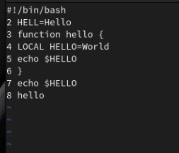{#fig:004 width=70%}

Нажмем клавишу Esc для перехода в командный режим, нажмем : для перехода в режим последней строки и нажмем w и q, а затем нажмем клавишу Enter для сохранения текста и завершения работы (рис. @fig:005).

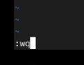{#fig:005 width=70%}

Сделаем файл исполняемым (рис. @fig:006).

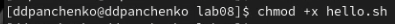{#fig:006 width=70%}

## Задание 2

Вызовем vi на редактирование файла (рис. @fig:007).

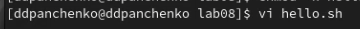{#fig:007 width=70%}

Заменим слово HELL на HELLO (рис. @fig:008).

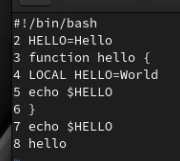{#fig:008 width=70%}

Заменим слово LOCAL на local (рис. @fig:009).

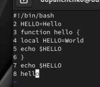{#fig:009 width=70%}

Вставим в конец следующий текст: echo $HELLO (рис. @fig:010).

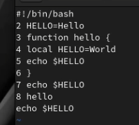{#fig:010 width=70%}

Удалим последнюю строку (рис. @fig:011).

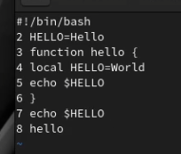{#fig:011 width=70%}

Введем команду отмены изменений u для отмены последней команды (рис. @fig:012 - @fig:013).

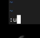{#fig:012 width=70%}

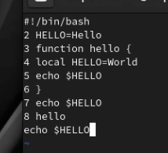{#fig:013 width=70%}

Введем символ : для перехода в режим последней строки. Запишем произведённые изменения и выйдем из vi (рис. @fig:014).

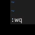{#fig:014 width=70%}

# Вывод

Я получил практические навыки работы с редактором vi.

# Контрольные вопросы

1. Дайте краткую характеристику режимам работы редактора vi.
В большинстве дистрибутивов Linux в качестве текстового редактора по умолчанию устанавливается интерактивный экранный редактор vi (Visual display editor).
Редактор vi имеет три режима работы:
– командный режим — предназначен для ввода команд редактирования и навигации по
редактируемому файлу;
– режим вставки — предназначен для ввода содержания редактируемого файла;
– режим последней (или командной) строки — используется для записи изменений в файл
и выхода из редактора.

2. Как выйти из редактора, не сохраняя произведённые изменения?
Находясь в командном режиме, нажать :, затем: набрать символ q, чтобы выйти из редактора без сохранения.

3. Назовите и дайте краткую характеристику командам позиционирования.
- 0 (ноль) — переход в начало строки;
- $ — переход в конец строки;
- G — переход в конец файла;
- n G — переход на строку с номером n.

4. Что для редактора vi является словом?
При использовании прописных W и B под разделителями понимаются только пробел, табуляция и возврат каретки. При использовании строчных w и b под разделителями понимаются также любые знаки пунктуации.

5. Каким образом из любого места редактируемого файла перейти в начало (конец) файла?
- G — переход в конец файла;
- n G — переход на строку с номером n.

6. Назовите и дайте краткую характеристику основным группам команд редактирования.
1. Вставка текста
- а — вставить текст после курсора;
- А — вставить текст в конец строки;
- i — вставить текст перед курсором;
- n i — вставить текст n раз;
- I — вставить текст в начало строки.
2. Вставка строки
- о — вставить строку под курсором;
- О — вставить строку над курсором.
3. Удаление текста
- x — удалить один символ в буфер;
- d w — удалить одно слово в буфер;
- d $ — удалить в буфер текст от курсора до конца строки;
- d 0 — удалить в буфер текст от начала строки до позиции курсора;
- d d — удалить в буфер одну строку;
- n d d — удалить в буфер n строк.
4. Отмена и повтор произведённых изменений
- u — отменить последнее изменение;
- . — повторить последнее изменение.
5. Копирование текста в буфер
- Y — скопировать строку в буфер;
- n Y — скопировать n строк в буфер;
- y w — скопировать слово в буфер.
6. Вставка текста из буфера
- p — вставить текст из буфера после курсора;
- P — вставить текст из буфера перед курсором.
7. Замена текста
- c w — заменить слово;
- n c w — заменить n слов;
- c $ — заменить текст от курсора до конца строки;
- r — заменить слово;
- R — заменить текст.
8. Поиск текста
- / текст — произвести поиск вперёд по тексту указанной строки символов текст;
- ? текст — произвести поиск назад по тексту указанной строки символов текст.

7. Необходимо заполнить строку символами $. Каковы ваши действия?
- о — вставить строку под курсором;
- О — вставить строку над курсором.

8. Как отменить некорректное действие, связанное с процессом редактирования?
u — отменить последнее изменение.

9. Назовите и дайте характеристику основным группам команд режима последней строки.
- : set all — вывести полный список опций;
- : set nu — вывести номера строк;
- : set list — вывести невидимые символы;
- : set ic — не учитывать при поиске, является ли символ прописным или строчным.

10. Как определить, не перемещая курсора, позицию, в которой заканчивается строка?
$ — переход в конец строки.
