---
## Front matter
lang: ru-RU
title: Лабораторная работа 
subtitle: Текстовой редактор emacs
author:
  - Панченко Д. Д.
institute:
  - Российский университет дружбы народов, Москва, Россия
date: 3 апреля 2023

## i18n babel
babel-lang: russian
babel-otherlangs: english

## Formatting pdf
toc: false
toc-title: Содержание
slide_level: 2
aspectratio: 169
section-titles: true
theme: metropolis
header-includes:
 - \metroset{progressbar=frametitle,sectionpage=progressbar,numbering=fraction}
 - '\makeatletter'
 - '\beamer@ignorenonframefalse'
 - '\makeatother'
---

# Информация

## Докладчик

  * Панченко Денис Дмитриевич
  * Студент 1 курса факультета физико-математических наук.
  * Российский университет дружбы народов
  * [derenchikde@gmail.com](mailto:derenchikde@gmail.com)

## Цели и задачи

Получить практические навыки работы с редактором emacs.

# Выполнение лабораторной работы

## Откроем emacs.

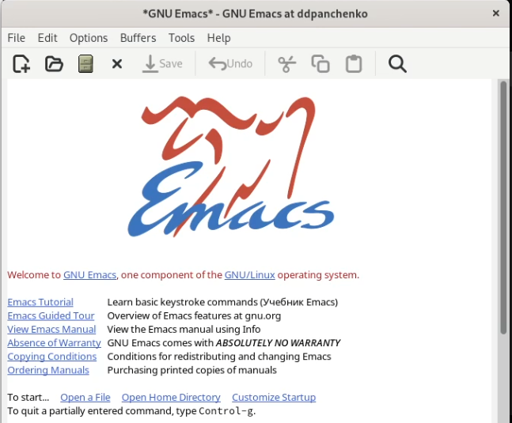{#fig:001 width=70%}

## Создадим файл lab09.sh.

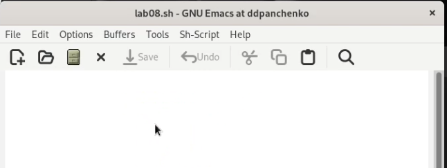{#fig:002 width=70%}

## Наберем следующий текст.

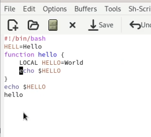{#fig:003 width=70%}

## Сохраним файл.

Сохраним файл

## Вырежем целую строку.

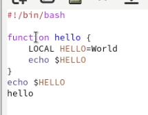{#fig:004 width=70%}

## Вставим эту строку в конец файла.

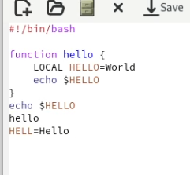{#fig:005 width=70%}

## Выделим область текста и скопируем её.

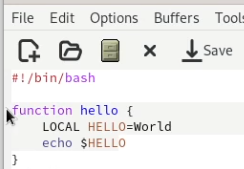{#fig:006 width=70%}

## Вставим область в конец файла.

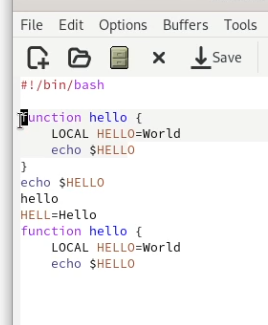{#fig:007 width=70%}

## Выделим эту область и вырежем её.

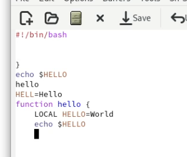{#fig:008 width=70%}

## Отменим последнее действие.

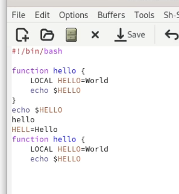{#fig:009 width=70%}

## Научимся использовать команды по перемещению курсора.

1) Перемещение курсора в начало строки
2) Перемещение курсора в конец строки
3) Перемещение курсора в начало буфера
4) Перемещение курсора в конец буфера

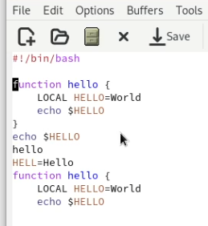{#fig:010 width=70%}

## Выведем список активных буферов на экран.

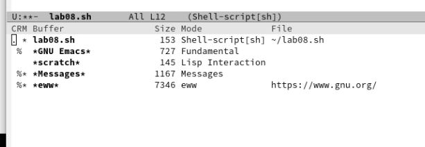{#fig:011 width=70%}

## Переключимся на другой буфер.

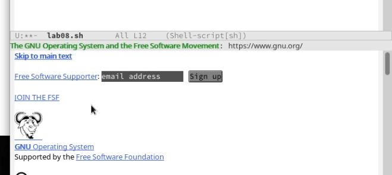{#fig:012 width=70%}

## Закроем это окно.

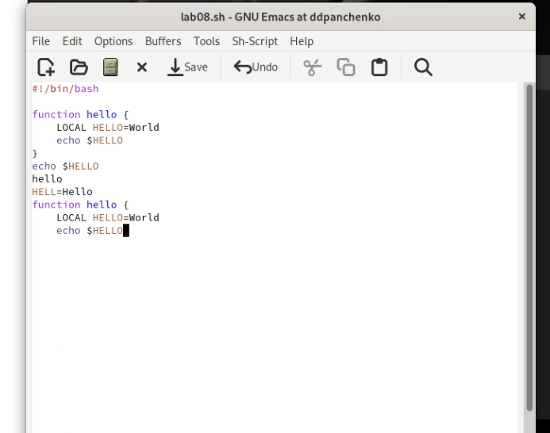{#fig:013 width=70%}

## Поделим фрейм на 4 части.

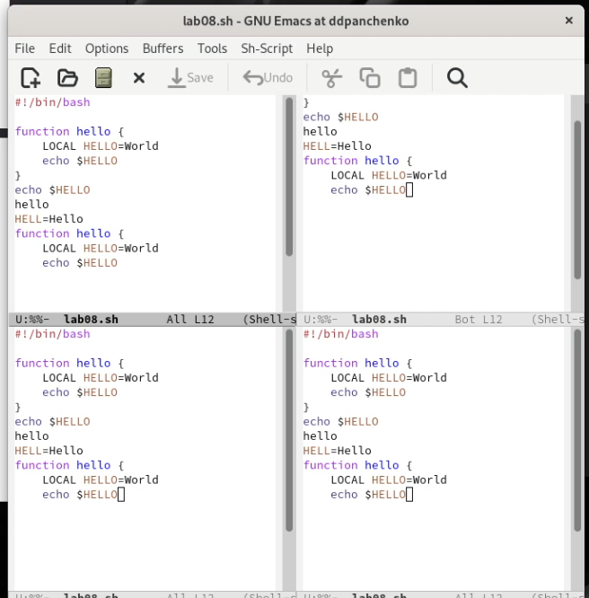{#fig:014 width=70%}

## В каждом из четырёх созданных окон введем несколько строк текста.

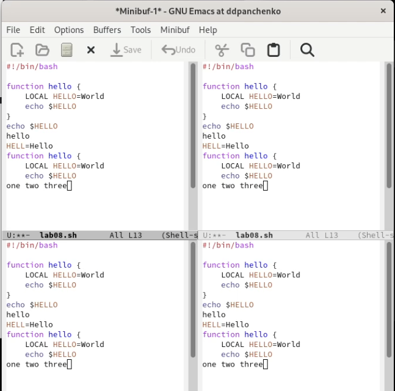{#fig:015 width=70%}

## Переключимся в режим поиска и найдем слово, присутствующее в тексте.

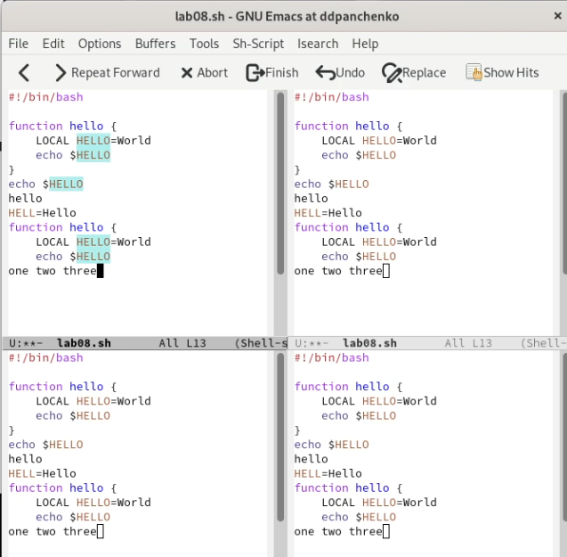{#fig:016 width=70%}

## Переключимся между результатами поиска.

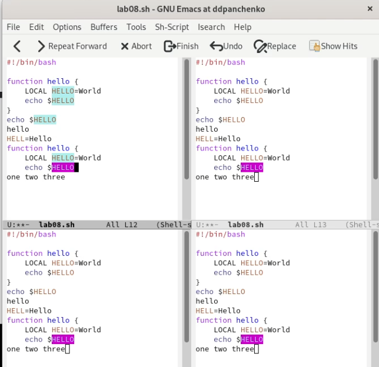{#fig:017 width=70%}

## Выйдем из режима поиска.

Выйдем из режима поиска

# Вывод

Я получил практические навыки работы с редактором emacs.
