---
## Front matter
title: "Лабораторная работа №9"
subtitle: "Текстовой редактор emacs"
author: "Панченко Денис Дмитриевич"

## Generic otions
lang: ru-RU
toc-title: "Содержание"

## Bibliography
bibliography: bib/cite.bib
csl: pandoc/csl/gost-r-7-0-5-2008-numeric.csl

## Pdf output format
toc: true # Table of contents
toc-depth: 2
lof: true # List of figures
lot: false # List of tables
fontsize: 12pt
linestretch: 1.5
papersize: a4
documentclass: scrreprt
## I18n polyglossia
polyglossia-lang:
  name: russian
  options:
	- spelling=modern
	- babelshorthands=true
polyglossia-otherlangs:
  name: english
## I18n babel
babel-lang: russian
babel-otherlangs: english
## Fonts
mainfont: PT Serif
romanfont: PT Serif
sansfont: PT Sans
monofont: PT Mono
mainfontoptions: Ligatures=TeX
romanfontoptions: Ligatures=TeX
sansfontoptions: Ligatures=TeX,Scale=MatchLowercase
monofontoptions: Scale=MatchLowercase,Scale=0.9
## Biblatex
biblatex: true
biblio-style: "gost-numeric"
biblatexoptions:
  - parentracker=true
  - backend=biber
  - hyperref=auto
  - language=auto
  - autolang=other*
  - citestyle=gost-numeric
## Pandoc-crossref LaTeX customization
figureTitle: "Рис."
tableTitle: "Таблица"
listingTitle: "Листинг"
lofTitle: "Список иллюстраций"
lotTitle: "Список таблиц"
lolTitle: "Листинги"
## Misc options
indent: true
header-includes:
  - \usepackage{indentfirst}
  - \usepackage{float} # keep figures where there are in the text
  - \floatplacement{figure}{H} # keep figures where there are in the text
---

# Цель работы

Получить практические навыки работы с редактором emacs.

# Выполнение лабораторной работы

Откроем emacs (рис. @fig:001).

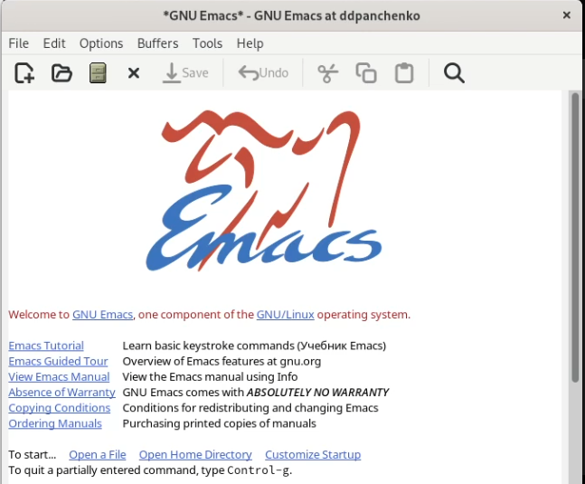{#fig:001 width=70%}

Создадим файл lab09.sh  (рис. @fig:002).

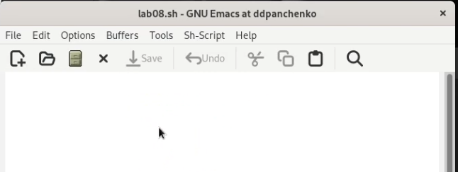{#fig:002 width=70%}

Наберем следующий текст (рис. @fig:003).

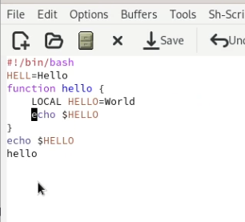{#fig:003 width=70%}

Сохраним файл.

Вырежем целую строку (рис. @fig:004).

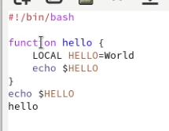{#fig:004 width=70%}

Вставим эту строку в конец файла (рис. @fig:005).

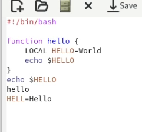{#fig:005 width=70%}

Выделим область текста и скопируем её (рис. @fig:006).

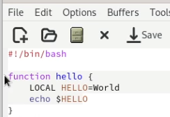{#fig:006 width=70%}

Вставим область в конец файла (рис. @fig:007).

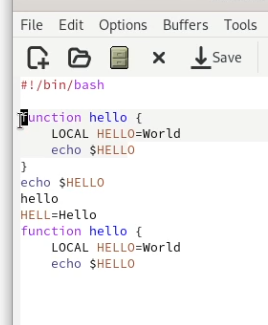{#fig:007 width=70%}

Выделим эту область и вырежем её (рис. @fig:008).

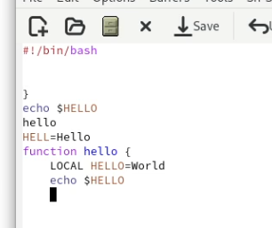{#fig:008 width=70%}

Отменим последнее действие (рис. @fig:009).

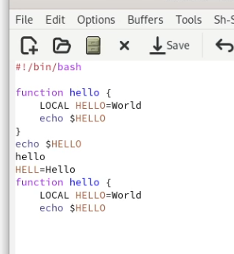{#fig:009 width=70%}

Научимся использовать команды по перемещению курсора (рис. @fig:010).
1) Перемещение курсора в начало строки
2) Перемещение курсора в конец строки
3) Перемещение курсора в начало буфера
4) Перемещение курсора в конец буфера

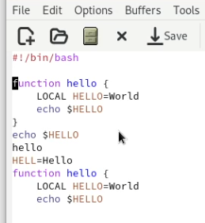{#fig:010 width=70%}

Выведем список активных буферов на экран (рис. @fig:011).

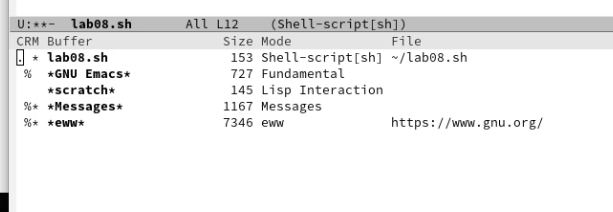{#fig:011 width=70%}

Переключимся на другой буфер (рис. @fig:012).

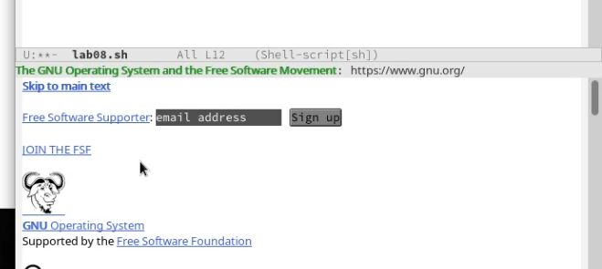{#fig:012 width=70%}

Закроем это окно (рис. @fig:013).

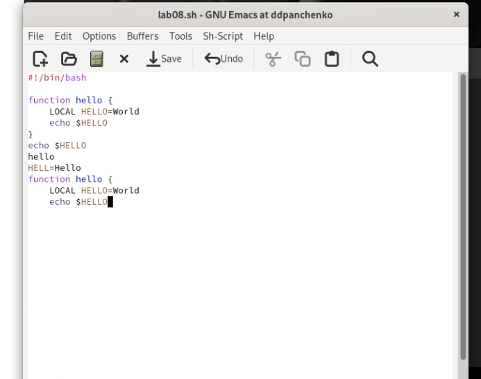{#fig:013 width=70%}

Поделим фрейм на 4 части (рис. @fig:014).

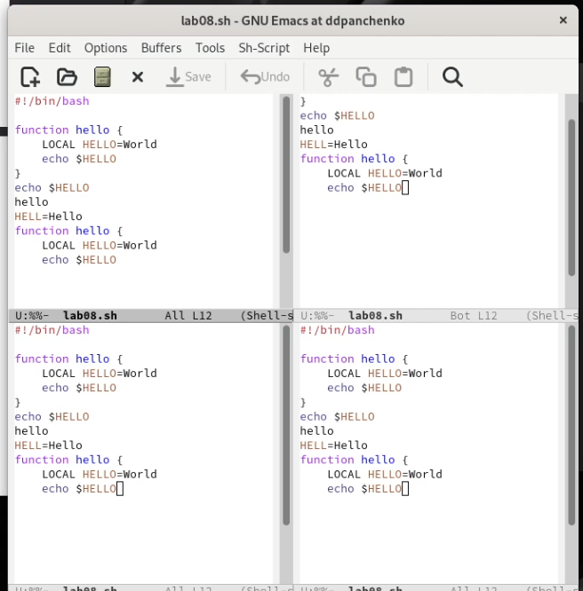{#fig:014 width=70%}

В каждом из четырёх созданных окон введем несколько строк текста (рис. @fig:015).

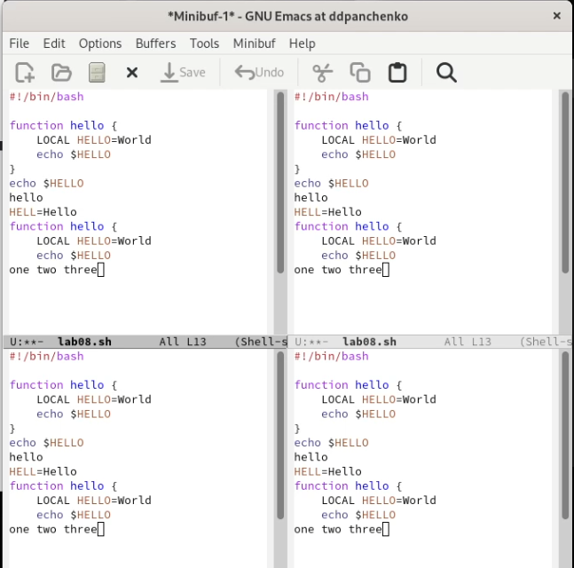{#fig:015 width=70%}

Переключимся в режим поиска и найдем слово, присутствующее в тексте (рис. @fig:016).

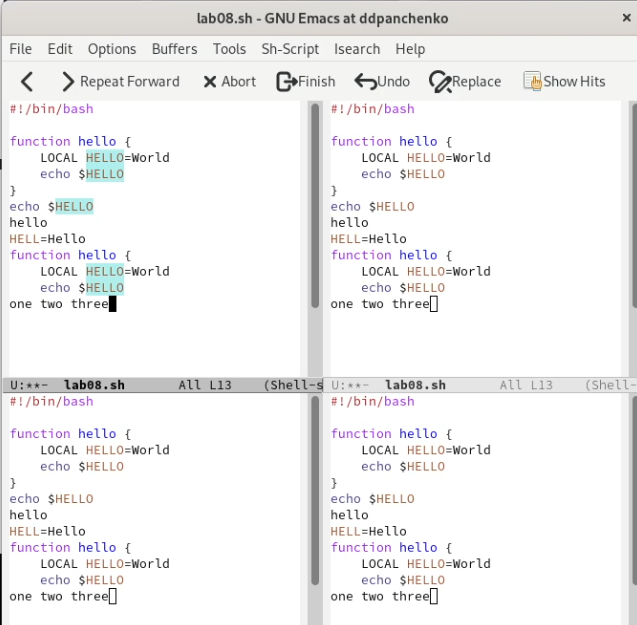{#fig:016 width=70%}

Переключимся между результатами поиска (рис. @fig:017).

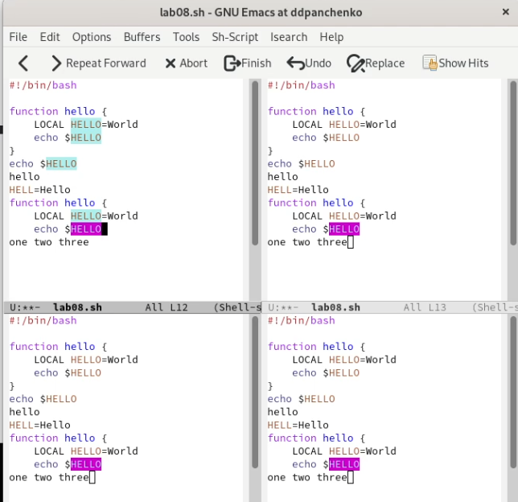{#fig:017 width=70%}

Выйдем из режима поиска.

# Вывод

Я получил практические навыки работы с редактором emacs.

# Контрольные вопросы

1. Кратко охарактеризуйте редактор emacs.
Emacs – достаточно развитый текстовый редактор. Он предоставляет средства, которые дают “нечто большее, чем простая вставка или удаление”, а именно: Просмотр и редактирование 2-х или более файлов (с возможностью перемещения текста между файлами).

2. Какие особенности данного редактора могут сделать его сложным для освоения новичком?
- Обилие сокращений и команд: Emacs использует множество сокращений и команд, что может быть сложно для начинающих.
- Отсутствие графической оболочки: Emacs работает в текстовом режиме, что может быть непривычным для пользователей, привыкших к графическим интерфейсам.
- Неинтуитивный интерфейс: Интерфейс Emacs может показаться сложным для новичков, т.к. он отличается от стандартных графических интерфейсов и требует некоторой привычки.
- Необходимость изучения специальных языков: Emacs использует специальные языки для описания своих функций, что также может быть сложно для новичков.
- Сложность конфигурации: Emacs имеет множество конфигурационных файлов, что может быть сложно для начинающих пользователей, не знакомых с концепцией настройки программного обеспечения.

3. Своими словами опишите, что такое буфер и окно в терминологии emacs’а.
Буфер в редакторе Emacs - это временное хранилище для текста, который вы редактируете. Когда открывается файл в Emacs, он загружается в буфер. Вы можете работать с текстом в буфере, вносить изменения и сохранять изменения обратно в файл.
Окно в Emacs отображает содержимое буфера. Если у вас есть несколько открытых буферов, вы можете использовать различные окна, чтобы отображать содержимое каждого буфера. Вы также можете разбить окно на несколько частей, чтобы отображать различные части того же буфера одновременно. Вы можете перемещаться между окнами и буферами, чтобы редактировать различные части текста в Emacs.

4. Можно ли открыть больше 10 буферов в одном окне?
Да, можно.

5. Какие буферы создаются по умолчанию при запуске emacs?
При запуске Emacs создаются следующие буферы по умолчанию:
- *scratch* - буфер, используемый для экспериментирования и тестирования Lisp-выражений, он является стартовой страницей для большинства пользователей
- *Messages* - буфер, в который записываются сообщения об ошибках, предупреждения и другие системные сообщения
- *GNU Emacs* - буфер, который содержит информацию и документацию о текущей версии Emacs
- *Echo Area* - буфер, в котором отображаются сообщения командной строки
- *Minibuffer* - буфер, используемый для ввода команд, файловых имён и других аргументов функций
- *Buffer List* - буфер, в котором показывается список всех открытых буферов
- *Toolbar Edit* - буфер, содержащий кнопки для выполнения команд путём нажатия на них мышью.

6. Какие клавиши вы нажмёте, чтобы ввести следующую комбинацию C-c | и C-c C-|?
Для ввода комбинации C-c | используются клавиши Control и c, затем клавиша |. Для ввода комбинации C-c C-| используются клавиши Control и c, затем клавиши Control и | одновременно.

7. Как поделить текущее окно на две части?
Чтобы разделить текущее окно на две части в Emacs, необходимо использовать комбинацию клавиш "Ctrl + x", затем "2". Это создаст две вертикально расположенные рабочие области в текущем окне.

8. В каком файле хранятся настройки редактора emacs?
Настройки редактора Emacs хранятся в файле .emacs или в файле .emacs.d/init.el.

9. Какую функцию выполняет клавиша Backspace и можно ли её переназначить?
Клавиша Backspace является клавишей удаления и удаляет символы слева от места, где находится курсор. Она используется для исправления ошибок при вводе текста. 
Клавишу Backspace можно переназначить с помощью специальных программ, которые позволяют настроить клавиатуру под свои потребности. Например, в операционной системе Windows можно воспользоваться программой SharpKeys. Однако, изменение функциональности клавиш может привести к трудностям при работе на других компьютерах и может потребовать дополнительной настройки.

10. Какой редактор вам показался удобнее в работе vi или emacs? Поясните почему.
Vi быстрее и эффективнее благодаря удобному управлению с помощью командной строки и возможности использовать многочисленные горячие клавиши. В то же время, другим пользователям могут показаться эти функции сложными и неудобными.
Emacs гибок и имеет широкий спектр возможностей благодаря множеству встроенных функций и расширений. Однако, люди, которые привыкли к более простым редакторам, могут считать Emacs слишком сложным.
