---
## Front matter
lang: ru-RU
title: Лабораторная работа 
subtitle: Программирование в командном процессоре ОС UNIX. Командные файлы
author:
  - Панченко Д. Д.
institute:
  - Российский университет дружбы народов, Москва, Россия
date: 10 апреля 2023

## i18n babel
babel-lang: russian
babel-otherlangs: english

## Formatting pdf
toc: false
toc-title: Содержание
slide_level: 2
aspectratio: 169
section-titles: true
theme: metropolis
header-includes:
 - \metroset{progressbar=frametitle,sectionpage=progressbar,numbering=fraction}
 - '\makeatletter'
 - '\beamer@ignorenonframefalse'
 - '\makeatother'
---

# Информация

## Докладчик

  * Панченко Денис Дмитриевич
  * Студент 1 курса факультета физико-математических наук.
  * Российский университет дружбы народов
  * [derenchikde@gmail.com](mailto:derenchikde@gmail.com)

## Цели и задачи

Изучить основы программирования в оболочке ОС UNIX/Linux. Научиться писать небольшие командные файлы.

# Выполнение лабораторной работы

## Создаем файл для написания первого скрипта.

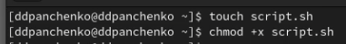{#fig:001 width=70%}

## Узнаем об архиваторе tar.

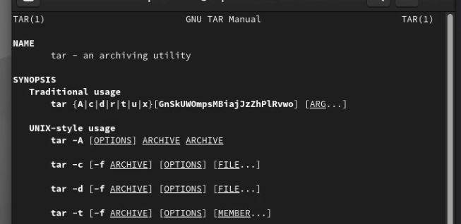{#fig:002 width=70%}

## Пишем скрипт, который при запуске будет делать резервную копию самого себя в другую директорию backup в нашем домашнем каталоге.

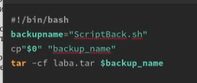{#fig:003 width=70%}

## Создаем файл для второго скрипта.

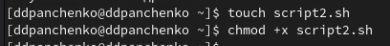{#fig:004 width=70%}

## Пишем скрипт, обрабатывающий любое произвольное число аргументов командной строки.

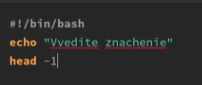{#fig:005 width=70%}

## Проверяем скрипт.

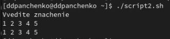{#fig:006 width=70%}

## Создаем третий файл для скрипта.

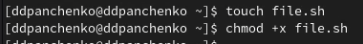{#fig:007 width=70%}

## Пишем командный файл — аналог команды ls.

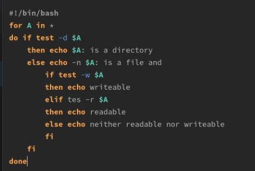{#fig:008 width=70%}

## Проверяем скрипт.

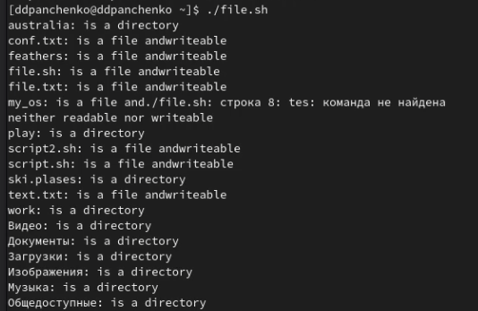{#fig:009 width=70%}

## Создаем файл для четвертого скрипта.

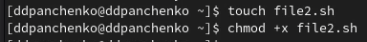{#fig:010 width=70%}

## Пишем командный файл, который получает в качестве аргумента командной строки формат файла и вычисляет количество таких файлов в указанной директории.

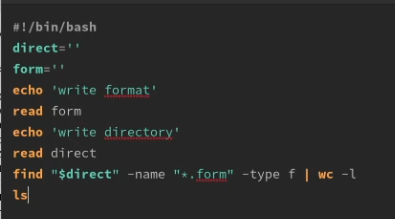{#fig:011 width=70%}

## Проверяем скрипт.

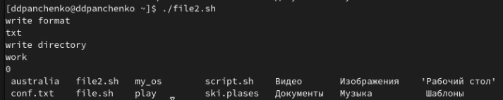{#fig:012 width=70%}

# Вывод

Я изучил основы программирования в оболочке ОС UNIX/Linux. Научиляся писать небольшие командные файлы.
