---
## Front matter
title: "Лабораторная работа №10"
subtitle: "Программирование в командном процессоре ОС UNIX. Командные файлы"
author: "Панченко Денис Дмитриевич"

## Generic otions
lang: ru-RU
toc-title: "Содержание"

## Bibliography
bibliography: bib/cite.bib
csl: pandoc/csl/gost-r-7-0-5-2008-numeric.csl

## Pdf output format
toc: true # Table of contents
toc-depth: 2
lof: true # List of figures
lot: false # List of tables
fontsize: 12pt
linestretch: 1.5
papersize: a4
documentclass: scrreprt
## I18n polyglossia
polyglossia-lang:
  name: russian
  options:
	- spelling=modern
	- babelshorthands=true
polyglossia-otherlangs:
  name: english
## I18n babel
babel-lang: russian
babel-otherlangs: english
## Fonts
mainfont: PT Serif
romanfont: PT Serif
sansfont: PT Sans
monofont: PT Mono
mainfontoptions: Ligatures=TeX
romanfontoptions: Ligatures=TeX
sansfontoptions: Ligatures=TeX,Scale=MatchLowercase
monofontoptions: Scale=MatchLowercase,Scale=0.9
## Biblatex
biblatex: true
biblio-style: "gost-numeric"
biblatexoptions:
  - parentracker=true
  - backend=biber
  - hyperref=auto
  - language=auto
  - autolang=other*
  - citestyle=gost-numeric
## Pandoc-crossref LaTeX customization
figureTitle: "Рис."
tableTitle: "Таблица"
listingTitle: "Листинг"
lofTitle: "Список иллюстраций"
lotTitle: "Список таблиц"
lolTitle: "Листинги"
## Misc options
indent: true
header-includes:
  - \usepackage{indentfirst}
  - \usepackage{float} # keep figures where there are in the text
  - \floatplacement{figure}{H} # keep figures where there are in the text
---

# Цель работы

Изучить основы программирования в оболочке ОС UNIX/Linux. Научиться писать небольшие командные файлы.

# Выполнение лабораторной работы

Создаем файл для написания первого скрипта (рис. @fig:001).

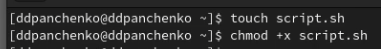{#fig:001 width=70%}

Узнаем об архиваторе tar (рис. @fig:002).

{#fig:002 width=70%}

Пишем скрипт, который при запуске будет делать резервную копию самого себя в другую директорию backup в нашем домашнем каталоге (рис. @fig:003).

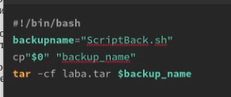{#fig:003 width=70%}

Создаем файл для второго скрипта (рис. @fig:004).

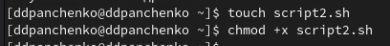{#fig:004 width=70%}

Пишем скрипт, обрабатывающий любое произвольное число аргументов командной строки (рис. @fig:005).

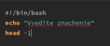{#fig:005 width=70%}

Проверяем скрипт (рис. @fig:006).

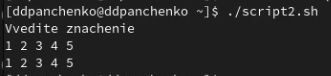{#fig:006 width=70%}

Создаем третий файл для скрипта (рис. @fig:007).

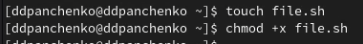{#fig:007 width=70%}

Пишем командный файл — аналог команды ls (рис. @fig:008).

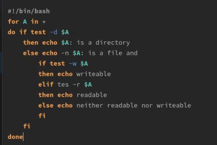{#fig:008 width=70%}

Проверяем скрипт (рис. @fig:009).

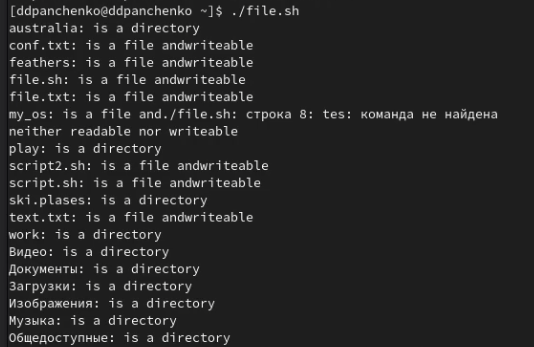{#fig:009 width=70%}

Создаем файл для четвертого скрипта (рис. @fig:010).

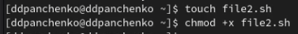{#fig:010 width=70%}

Пишем командный файл, который получает в качестве аргумента командной строки формат файла и вычисляет количество таких файлов в указанной директории. (рис. @fig:011).

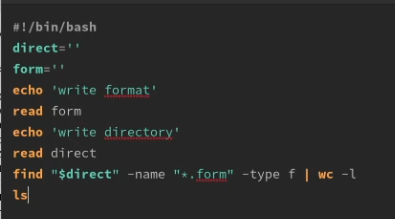{#fig:011 width=70%}

Проверяем скрипт (рис. @fig:012).

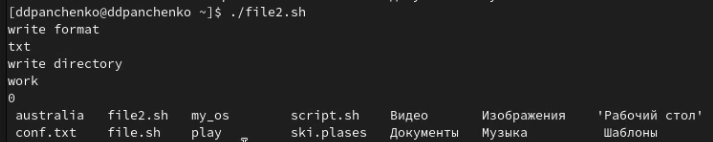{#fig:012 width=70%}

# Вывод

Я изучил основы программирования в оболочке ОС UNIX/Linux. Научиляся писать небольшие командные файлы.

# Контрольные вопросы

1. Командная оболочка (shell) - это интерпретатор, который принимает команды пользователя и выполняет их на уровне операционной системы. Примеры командных оболочек: bash, sh, csh, ksh, zsh. Они отличаются синтаксисом и набором возможностей.

2. POSIX (Portable Operating System Interface) - это набор стандартов, которые определяют поведение операционной системы и интерфейс прикладных программ. Это позволяет написать переносимый код, который будет работать на разных операционных системах (Linux, macOS, Unix, Windows и др.).

3. Переменные задаются в виде `name=value`, например `x=10`. Доступ к переменной осуществляется через знак `$`, например `$x`. Массивы задаются в виде `array=(value1 value2 value3)`, а доступ к элементу массива осуществляется через индекс в квадратных скобках, например `${array[0]}`.

4. Оператор `let` используется для выполнения арифметических операций и присваивания результата переменной, например `let x=1+2`. Оператор `read` используется для чтения ввода пользователя в переменную, например `read x`.

5. В bash можно использовать арифметические операции `+`, `-`, `*`, `/`, `%`, `**`.

6. Операция `(( ))` используется для выполнения арифметических операций и вычисления выражений в скобках, например `((x=1+2))`.

7. Некоторые стандартные имена переменных: `$HOME` (домашняя директория), `$PATH` (список директорий для поиска исполняемых файлов), `$USER` (имя текущего пользователя), `$PWD` (текущий рабочий каталог).

8. Метасимволы - это специальные символы, которые имеют особое значение в командной строке. Примеры: `*` (соответствует нулю или более символов), `?` (соответствует одному символу), `[ ]` (соответствует символам из заданного набора).

9. Метасимволы можно экранировать с помощью обратной косой черты `\`. Например, `\$`.

10. Командный файл создается в текстовом редакторе и сохраняется с расширением `.sh`. Запустить его можно с помощью команды `./script.sh`. Необходимо предварительно дать файлу право на выполнение с помощью команды `chmod +x script.sh`.

11. Функция задается в виде `function name { commands }`. Вызвать функцию можно, например, `name`.

12. Для проверки типа файла можно использовать команду `test -d filename` для проверки, является ли файл каталогом, и `test -f filename` для проверки, является ли файл обычным файлом.

13. `set` используется для задания опций командной строки и установки значений специальных переменных. `typeset` используется для определения типа переменной (например, числовая или строковая). `unset` используется для удаления переменной.

14. Параметры передаются в виде аргументов командной строки. В командном файле к ним можно обратиться с помощью переменных `$1`, `$2` и т.д.

15. Специальные переменные: `$0` (имя командного файла), `$#` (количество аргументов командной строки), `$@` (список всех аргументов командной строки), `$?` (код возврата последней выполненной команды).
