---
## Front matter
lang: ru-RU
title: Лабораторная работа 
subtitle: Программирование в командном процессоре ОС UNIX. Ветвления и циклы
author:
  - Панченко Д. Д.
institute:
  - Российский университет дружбы народов, Москва, Россия
date: 17 апреля 2023

## i18n babel
babel-lang: russian
babel-otherlangs: english

## Formatting pdf
toc: false
toc-title: Содержание
slide_level: 2
aspectratio: 169
section-titles: true
theme: metropolis
header-includes:
 - \metroset{progressbar=frametitle,sectionpage=progressbar,numbering=fraction}
 - '\makeatletter'
 - '\beamer@ignorenonframefalse'
 - '\makeatother'
---

# Информация

## Докладчик

  * Панченко Денис Дмитриевич
  * Студент 1 курса факультета физико-математических наук.
  * Российский университет дружбы народов
  * [derenchikde@gmail.com](mailto:derenchikde@gmail.com)

## Цели и задачи

Изучить основы программирования в оболочке ОС UNIX. Научится писать более сложные командные файлы с использованием логических управляющих конструкций и циклов.

# Выполнение лабораторной работы

## Используя команды getopts grep, напишем командный файл, который анализирует командную строку с заданными ключами, а затем ищет в указанном файле нужные строки, определяемые ключом -p.

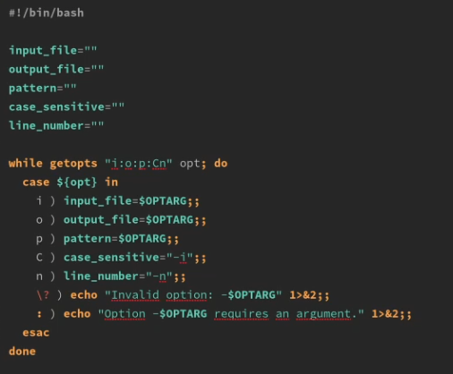{#fig:001 width=70%}

## 

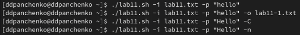{#fig:002 width=70%}

## Напишем на языке Си программу, которая вводит число и определяет, является ли оно больше нуля, меньше нуля или равно нулю. Командный файл должен вызывать эту программу и выдать сообщение о том, какое число было введено.

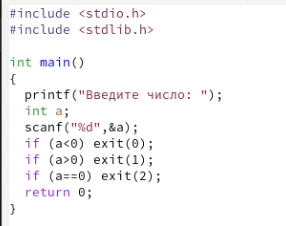{#fig:003 width=70%}

## 

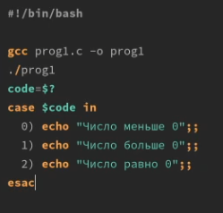{#fig:004 width=70%}

## 

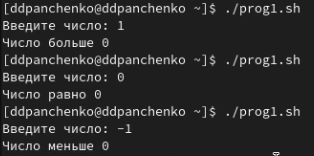{#fig:005 width=70%}

## Написать командный файл, создающий указанное число файлов, пронумерованных последовательно от 1 до N. Этот же командный файл должен уметь удалять все созданные им файлы.

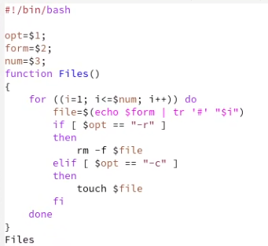{#fig:006 width=70%}

## 

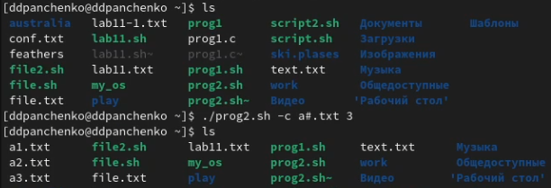{#fig:007 width=70%}

## 

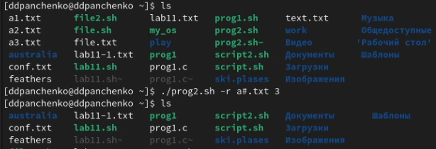{#fig:008 width=70%}

## Напишем командный файл, который с помощью команды tar запаковывает в архив все файлы в указанной директории.

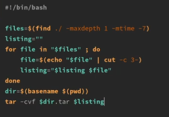{#fig:009 width=70%}

## 

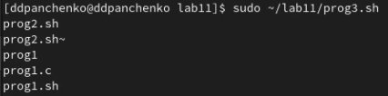{#fig:010 width=70%}

## 

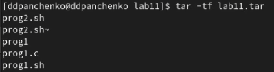{#fig:011 width=70%}

## 

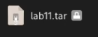{#fig:012 width=70%}

# Вывод

Я изучил основы программирования в оболочке ОС UNIX/Linux. Научился писать более сложные командные файлы с использованием логических управляющих конструкций и циклов.
