---
## Front matter
title: "Лабораторная работа №11"
subtitle: "Программирование в командном процессоре ОС UNIX. Ветвления и циклы"
author: "Панченко Денис Дмитриевич"

## Generic otions
lang: ru-RU
toc-title: "Содержание"

## Bibliography
bibliography: bib/cite.bib
csl: pandoc/csl/gost-r-7-0-5-2008-numeric.csl

## Pdf output format
toc: true # Table of contents
toc-depth: 2
lof: true # List of figures
lot: false # List of tables
fontsize: 12pt
linestretch: 1.5
papersize: a4
documentclass: scrreprt
## I18n polyglossia
polyglossia-lang:
  name: russian
  options:
	- spelling=modern
	- babelshorthands=true
polyglossia-otherlangs:
  name: english
## I18n babel
babel-lang: russian
babel-otherlangs: english
## Fonts
mainfont: PT Serif
romanfont: PT Serif
sansfont: PT Sans
monofont: PT Mono
mainfontoptions: Ligatures=TeX
romanfontoptions: Ligatures=TeX
sansfontoptions: Ligatures=TeX,Scale=MatchLowercase
monofontoptions: Scale=MatchLowercase,Scale=0.9
## Biblatex
biblatex: true
biblio-style: "gost-numeric"
biblatexoptions:
  - parentracker=true
  - backend=biber
  - hyperref=auto
  - language=auto
  - autolang=other*
  - citestyle=gost-numeric
## Pandoc-crossref LaTeX customization
figureTitle: "Рис."
tableTitle: "Таблица"
listingTitle: "Листинг"
lofTitle: "Список иллюстраций"
lotTitle: "Список таблиц"
lolTitle: "Листинги"
## Misc options
indent: true
header-includes:
  - \usepackage{indentfirst}
  - \usepackage{float} # keep figures where there are in the text
  - \floatplacement{figure}{H} # keep figures where there are in the text
---

# Цель работы

Изучить основы программирования в оболочке ОС UNIX. Научится писать более сложные командные файлы с использованием логических управляющих конструкций и циклов.

# Выполнение лабораторной работы

Используя команды getopts grep, напишем командный файл, который анализирует командную строку с заданными ключами, а затем ищет в указанном файле нужные строки, определяемые ключом -p. (рис. @fig:001 - @fig:002).

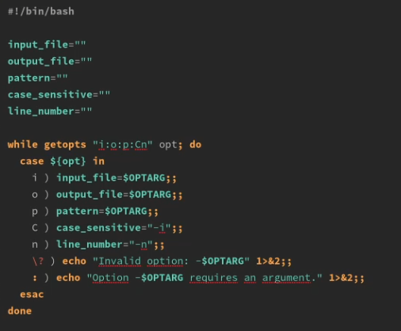{#fig:001 width=70%}

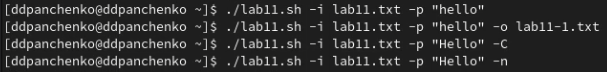{#fig:002 width=70%}

Напишем на языке Си программу, которая вводит число и определяет, является ли оно больше нуля, меньше нуля или равно нулю. Командный файл должен вызывать эту программу и выдать сообщение о том, какое число было введено (рис. @fig:003 - @fig:005).

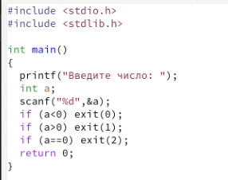{#fig:003 width=70%}

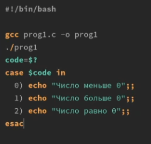{#fig:004 width=70%}

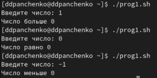{#fig:005 width=70%}

Написать командный файл, создающий указанное число файлов, пронумерованных
последовательно от 1 до N. Этот же командный файл должен уметь удалять все созданные им файлы (рис. @fig:006 - @fig:008).

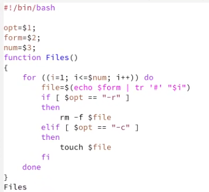{#fig:006 width=70%}

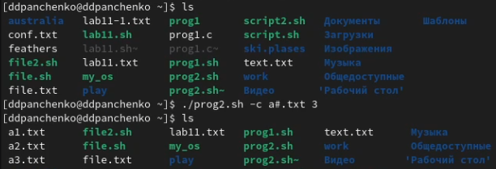{#fig:007 width=70%}

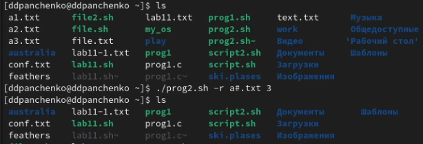{#fig:008 width=70%}

Напишем командный файл, который с помощью команды tar запаковывает в архив все файлы в указанной директории (рис. @fig:009 - @fig:012).

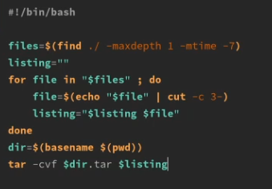{#fig:009 width=70%}

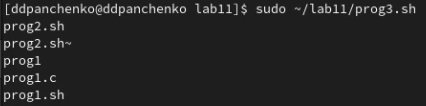{#fig:010 width=70%}

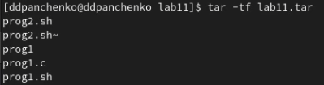{#fig:011 width=70%}

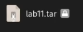{#fig:012 width=70%}

# Вывод

Я изучил основы программирования в оболочке ОС UNIX/Linux. Научился писать более сложные командные файлы с использованием логических управляющих конструкций и циклов.

# Контрольные вопросы

1. Команда getopts используется для обработки опций командной строки в скриптах на языке Bash. Она позволяет скрипту распознавать и обрабатывать опции, переданные ему при запуске, и выполнять соответствующие действия.

2. Метасимволы используются в Bash для шаблонного поиска и замены файлов в командной строке, а также для генерации имен файлов. Например, символ звездочки (*) может заменять любое количество любых символов в имени файла.

3. В Bash есть несколько операторов управления действиями, таких как if, else, elif, case, for, while, until. Они используются для выполнения определенных действий в зависимости от условий, заданных в скрипте.

4. Для прерывания цикла в Bash можно использовать операторы break и continue. Оператор break прерывает выполнение цикла и переходит к следующей команде после цикла, а оператор continue прерывает текущую итерацию цикла и переходит к следующей итерации.

5. Команда false возвращает код ошибки в скрипте, что может быть полезно для тестирования и отладки. Команда true, напротив, всегда возвращает успешный код завершения, что может быть полезно, например, для создания бесконечных циклов.

6. Данная строка проверяет, существует ли файл man$s/$i.$s в текущей директории, где $s и $i - переменные, заданные в скрипте.

7. Конструкция while используется для повторения блока команд до тех пор, пока определенное условие истинно, а конструкция until - до тех пор, пока определенное условие ложно. Поэтому, если условие выполняется сразу, блок команд в while ни разу не выполнится, а в until - выполнится один раз.
