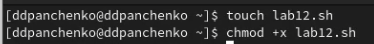
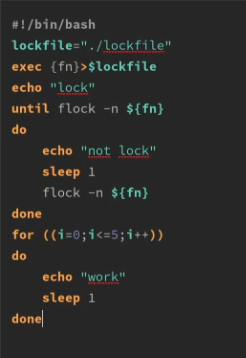
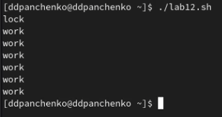
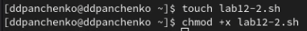
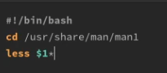
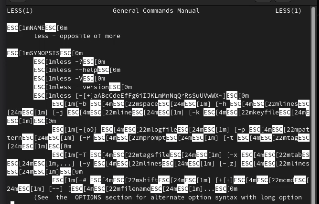
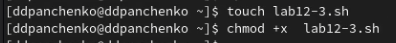
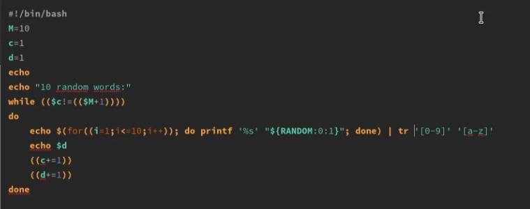
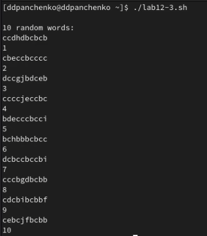

---
## Front matter
title: "Лабораторная работа №12"
subtitle: "Программирование в командном процессоре ОС UNIX. Расширенное программирование"
author: "Панченко Денис Дмитриевич"

## Generic otions
lang: ru-RU
toc-title: "Содержание"

## Bibliography
bibliography: bib/cite.bib
csl: pandoc/csl/gost-r-7-0-5-2008-numeric.csl

## Pdf output format
toc: true # Table of contents
toc-depth: 2
lof: true # List of figures
lot: false # List of tables
fontsize: 12pt
linestretch: 1.5
papersize: a4
documentclass: scrreprt
## I18n polyglossia
polyglossia-lang:
  name: russian
  options:
	- spelling=modern
	- babelshorthands=true
polyglossia-otherlangs:
  name: english
## I18n babel
babel-lang: russian
babel-otherlangs: english
## Fonts
mainfont: PT Serif
romanfont: PT Serif
sansfont: PT Sans
monofont: PT Mono
mainfontoptions: Ligatures=TeX
romanfontoptions: Ligatures=TeX
sansfontoptions: Ligatures=TeX,Scale=MatchLowercase
monofontoptions: Scale=MatchLowercase,Scale=0.9
## Biblatex
biblatex: true
biblio-style: "gost-numeric"
biblatexoptions:
  - parentracker=true
  - backend=biber
  - hyperref=auto
  - language=auto
  - autolang=other*
  - citestyle=gost-numeric
## Pandoc-crossref LaTeX customization
figureTitle: "Рис."
tableTitle: "Таблица"
listingTitle: "Листинг"
lofTitle: "Список иллюстраций"
lotTitle: "Список таблиц"
lolTitle: "Листинги"
## Misc options
indent: true
header-includes:
  - \usepackage{indentfirst}
  - \usepackage{float} # keep figures where there are in the text
  - \floatplacement{figure}{H} # keep figures where there are in the text
---

# Цель работы

Изучить основы программирования в оболочке ОС UNIX. Научиться писать более сложные командные файлы с использованием логических управляющих конструкций и циклов.

# Выполнение лабораторной работы

Напишем командный файл, реализующий упрощённый механизм семафоров (рис. @fig:001 - @fig:003).

{#fig:001 width=70%}

{#fig:002 width=70%}

{#fig:003 width=70%}

Реализуем команду man с помощью командного файла (рис. @fig:004 - @fig:007).

{#fig:004 width=70%}

{#fig:005 width=70%}

{#fig:006 width=70%}

{#fig:007 width=70%}

Используя встроенную переменную $RANDOM, напишем командный файл, генерирующий случайную последовательность букв латинского алфавита (рис. @fig:008 - @fig:010).

{#fig:008 width=70%}

{#fig:009 width=70%}

{#fig:010 width=70%}

# Вывод

Я изучил основы программирования в оболочке ОС UNIX/Linux. Научился писать более сложные командные файлы с использованием логических управляющих конструкций и циклов.

# Контрольные вопросы

1. Синтаксическая ошибка в данной строке заключается в том, что в bash используется двойное квадратное скобочное выражение для условных операторов, а не круглые скобки. Правильно будет написать так: while [ $1 != "exit" ].

2. Несколько строк можно объединить с помощью оператора конкатенации строк -, например: str1="Hello"; str2="world"; result=$str1-$str2; echo $result. В данном примере результатом будет строка "Hello-world".

3. Утилита seq используется для генерации последовательностей чисел. Пример использования: seq 1 10. Эта команда выведет последовательность чисел от 1 до 10. Альтернативными способами генерации последовательностей являются использование циклов for или while с использованием оператора счетчика, например: for i in {1..10}; do echo $i; done.

4. Выражение $((10/3)) даст результат 3, так как в bash при делении целых чисел используется целочисленное деление без округления.

5. Основные отличия командной оболочки zsh от bash:
- zsh имеет более продвинутый и удобный интерфейс командной строки;
- zsh имеет множество дополнительных функций и возможностей, таких как автодополнение путей и команд, подсветка синтаксиса и др.;
- zsh имеет более продвинутую систему настройки и использования алиасов и функций.

6. Данный синтаксис верен. Он используется для цикла for с заданным начальным значением, конечным значением и шагом счетчика.

7. Bash - это язык скриптовой обработки командной строки, который удобен для быстрого и простого выполнения повседневных задач в системе Unix/Linux. Он имеет простой синтаксис и понятную логику, что делает его легко доступным для новичков. Однако, в отличие от других языков программирования, bash не имеет широких возможностей для создания сложных алгоритмов и программ. Также, bash может быть медленнее в выполнении сложных задач по сравнению с более производительными языками программирования, такими как Python или Java.
