---
## Front matter
lang: ru-RU
title: Лабораторная работа 
subtitle: Средства, применяемые при разработке программного обеспечения в ОС типа UNIX/Linux
author:
  - Панченко Д. Д.
institute:
  - Российский университет дружбы народов, Москва, Россия
date: 1 мая 2023

## i18n babel
babel-lang: russian
babel-otherlangs: english

## Formatting pdf
toc: false
toc-title: Содержание
slide_level: 2
aspectratio: 169
section-titles: true
theme: metropolis
header-includes:
 - \metroset{progressbar=frametitle,sectionpage=progressbar,numbering=fraction}
 - '\makeatletter'
 - '\beamer@ignorenonframefalse'
 - '\makeatother'
---

# Информация

## Докладчик

  * Панченко Денис Дмитриевич
  * Студент 1 курса факультета физико-математических наук.
  * Российский университет дружбы народов
  * [derenchikde@gmail.com](mailto:derenchikde@gmail.com)

## Цели и задачи

Приобрести простейшие навыки разработки, анализа, тестирования и отладки приложений в ОС типа UNIX/Linux на примере создания на языке программирования С калькулятора с простейшими функциями.

# Выполнение лабораторной работы

## В домашнем каталоге создадим подкаталог ~/work/os/lab_prog.

{#fig:001 width=70%}

## Создадим в нём файлы: calculate.h, calculate.c, main.c.

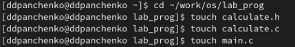{#fig:002 width=70%}

## Реализуем функцию калькулятора в файле calculate.c.

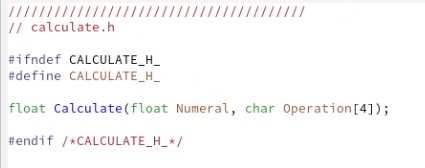{#fig:003 width=70%}

## Реализуем интерфейсный файл calculate.h, описывающий формат вызова функции-калькулятора.

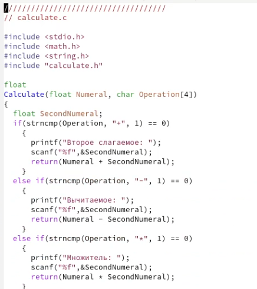{#fig:004 width=70%}

## Реализуем основной файл main.c, реализующий интерфейс пользователя к калькулятору.

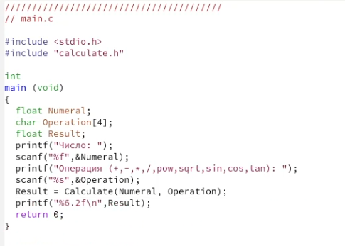{#fig:005 width=70%}

## Выполним компиляцию программы посредством gcc.

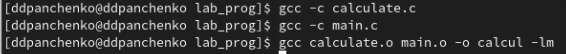{#fig:006 width=70%}

## Создадим Makefile со следующим содержанием.

{#fig:007 width=70%}

## 

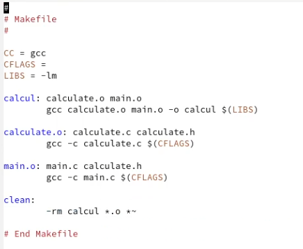{#fig:008 width=70%}

## С помощью gdb выполним отладку программы calcul.

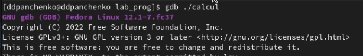{#fig:009 width=70%}

## 

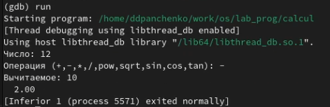{#fig:010 width=70%}

## 

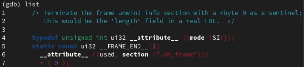{#fig:011 width=70%}

## 

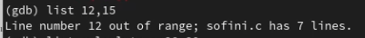{#fig:012 width=70%}

## 

{#fig:013 width=70%}

## 

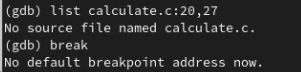{#fig:014 width=70%}

## 

{#fig:015 width=70%}

## 

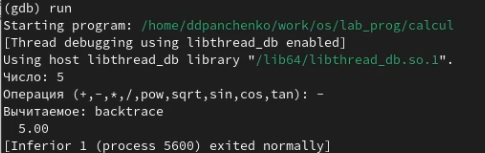{#fig:016 width=70%}

## 

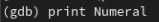{#fig:017 width=70%}

## 

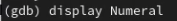{#fig:018 width=70%}

## 

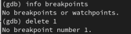{#fig:019 width=70%}

# Вывод

Я приобрел простейшие навыки разработки, анализа, тестирования и отладки приложений в ОС типа UNIX/Linux на примере создания на языке программирования С калькулятора с простейшими функциями.
