---
## Front matter
title: "Лабораторная работа №13"
subtitle: "Средства, применяемые при разработке программного обеспечения в ОС типа UNIX/Linux"
author: "Панченко Денис Дмитриевич"

## Generic otions
lang: ru-RU
toc-title: "Содержание"

## Bibliography
bibliography: bib/cite.bib
csl: pandoc/csl/gost-r-7-0-5-2008-numeric.csl

## Pdf output format
toc: true # Table of contents
toc-depth: 2
lof: true # List of figures
lot: false # List of tables
fontsize: 12pt
linestretch: 1.5
papersize: a4
documentclass: scrreprt
## I18n polyglossia
polyglossia-lang:
  name: russian
  options:
	- spelling=modern
	- babelshorthands=true
polyglossia-otherlangs:
  name: english
## I18n babel
babel-lang: russian
babel-otherlangs: english
## Fonts
mainfont: PT Serif
romanfont: PT Serif
sansfont: PT Sans
monofont: PT Mono
mainfontoptions: Ligatures=TeX
romanfontoptions: Ligatures=TeX
sansfontoptions: Ligatures=TeX,Scale=MatchLowercase
monofontoptions: Scale=MatchLowercase,Scale=0.9
## Biblatex
biblatex: true
biblio-style: "gost-numeric"
biblatexoptions:
  - parentracker=true
  - backend=biber
  - hyperref=auto
  - language=auto
  - autolang=other*
  - citestyle=gost-numeric
## Pandoc-crossref LaTeX customization
figureTitle: "Рис."
tableTitle: "Таблица"
listingTitle: "Листинг"
lofTitle: "Список иллюстраций"
lotTitle: "Список таблиц"
lolTitle: "Листинги"
## Misc options
indent: true
header-includes:
  - \usepackage{indentfirst}
  - \usepackage{float} # keep figures where there are in the text
  - \floatplacement{figure}{H} # keep figures where there are in the text
---

# Цель работы

Приобрести простейшие навыки разработки, анализа, тестирования и отладки приложений в ОС типа UNIX/Linux на примере создания на языке программирования С калькулятора с простейшими функциями.

# Выполнение лабораторной работы

В домашнем каталоге создадим подкаталог ~/work/os/lab_prog (рис. @fig:001).

{#fig:001 width=70%}

Создадим в нём файлы: calculate.h, calculate.c, main.c (рис. @fig:002).

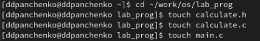{#fig:002 width=70%}

Реализуем функцию калькулятора в файле calculate.c (рис. @fig:003).

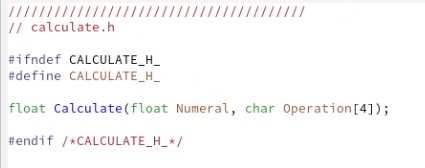{#fig:003 width=70%}

Реализуем интерфейсный файл calculate.h, описывающий формат вызова функции-калькулятора (рис. @fig:004).

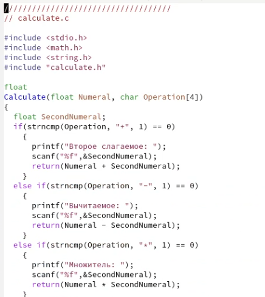{#fig:004 width=70%}

Реализуем основной файл main.c, реализующий интерфейс пользователя к калькулятору (рис. @fig:005).

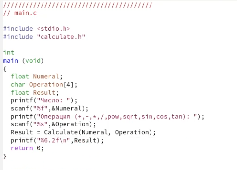{#fig:005 width=70%}

Выполним компиляцию программы посредством gcc (рис. @fig:006).

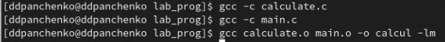{#fig:006 width=70%}

Создадим Makefile со следующим содержанием (рис. @fig:007 - @fig:008).

{#fig:007 width=70%}

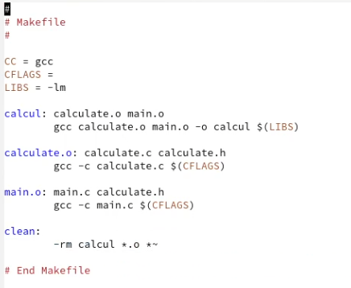{#fig:008 width=70%}

С помощью gdb выполним отладку программы calcul  (рис. @fig:009 - @fig:019).

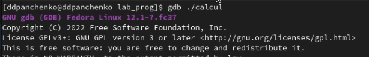{#fig:009 width=70%}

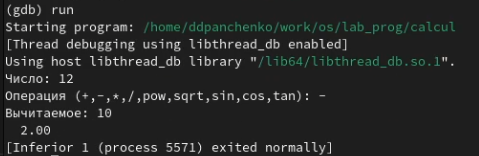{#fig:010 width=70%}

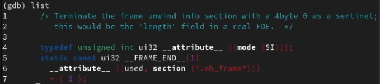{#fig:011 width=70%}

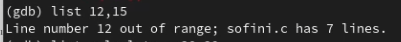{#fig:012 width=70%}

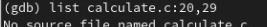{#fig:013 width=70%}

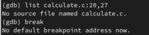{#fig:014 width=70%}

{#fig:015 width=70%}

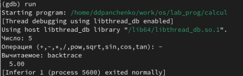{#fig:016 width=70%}

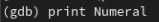{#fig:017 width=70%}

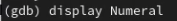{#fig:018 width=70%}

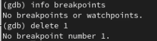{#fig:019 width=70%}

# Вывод

Я приобрел простейшие навыки разработки, анализа, тестирования и отладки приложений в ОС типа UNIX/Linux на примере создания на языке программирования С калькулятора с простейшими функциями.

# Контрольные вопросы

1. Информацию о возможностях программ gcc, make, gdb и др. можно получить из их официальной документации, а также из различных руководств и учебников по программированию на языке С и UNIX.

2. Основными этапами разработки приложений в UNIX являются:
- проектирование архитектуры приложения и выбор используемых технологий;
- написание и отладка исходного кода на языке С;
- компиляция исходного кода в исполняемый файл с помощью компилятора gcc;
- тестирование и отладка приложения с помощью отладчика gdb;
- сборка приложения и создание пакета для установки с помощью утилиты make.

3. Суффикс в контексте языка программирования - это часть имени файла, которая указывает на его тип или формат. Например, суффикс .c обозначает исходный код на языке С, а .o - объектный файл, полученный в результате компиляции исходного кода.

4. Основное назначение компилятора языка С в UNIX - преобразование исходного кода на языке С в машинный код, который может быть исполнен на компьютере.

5. Утилита make предназначена для автоматизации процесса сборки программы. Она позволяет определить зависимости между файлами и компонентами программы и автоматически проводить перекомпиляцию только тех файлов, которые изменились.

6. Пример структуры Makefile:
CC=gcc
CFLAGS=-Wall -Werror
LDFLAGS=-lm

main: main.o utils.o
 $(CC) $(LDFLAGS) -o main main.o utils.o

main.o: main.c
 $(CC) $(CFLAGS) -c main.c

utils.o: utils.c utils.h
 $(CC) $(CFLAGS) -c utils.c

Основные элементы:
- переменные, например CC, CFLAGS, LDFLAGS, которые определяют используемый компилятор, флаги компиляции и линковки;
- цели, например main, которые соответствуют именам файлов, которые нужно собрать;
- зависимости, например main.o: main.c, которые определяют зависимости между целями и файлами;
- команды, например $(CC) $(LDFLAGS) -o main main.o utils.o, которые определяют действия, необходимые для сборки файла.

7. Основное свойство, присущее всем программам отладки, - возможность остановки выполнения программы в определенной точке и пошагового ее выполнения. Чтобы его можно было использовать, необходимо включить в исходный код программы отладочную информацию, которую компилятор добавляет в объектный файл при использовании опции -g.

8. Основные команды отладчика gdb:
- run - запустить программу;
- break - установить точку останова;
- next - выполнить следующую строку кода, не заходя внутрь функций;
- step - выполнить следующую строку кода, заходя внутрь функций;
- print - вывести значение переменной;
- watch - установить точку останова при изменении значения переменной;
- quit - выйти из отладчика.

9. Схема отладки программы, которую я использовал при выполнении лабораторной работы:
- компиляция исходного кода с опцией -g;
- запуск отладчика gdb;
- установка точек останова в соответствующих местах кода;
- выполнение программы пошагово с помощью команд next и step;
- вывод значений переменных с помощью команды print;
- исправление ошибок в исходном коде и повторная компиляция.

10. Компилятор при первом запуске реагирует на синтаксические ошибки в программе и сообщает о них, указывая номер строки и тип ошибки. Это позволяет исправить ошибки и повторно скомпилировать программу.

11. Основные средства, повышающие понимание исходного кода программы:
- комментарии в коде, поясняющие его структуру и логику;
- правильное именование переменных, функций и классов;
- форматирование кода для улучшения его читаемости;
- использование отладочных сообщений, которые выводят информацию о ходе выполнения программы.

12. Основные задачи, решаемые программой splint - проверка кода на соответствие стандартам и рекомендациям по программированию на языке С. Она позволяет выявлять потенциальные ошибки и уязвимости в коде, а также улучшать его читаемость и поддерживаемость.
