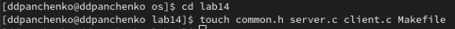
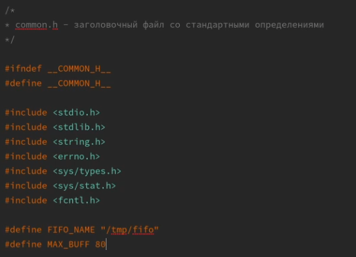
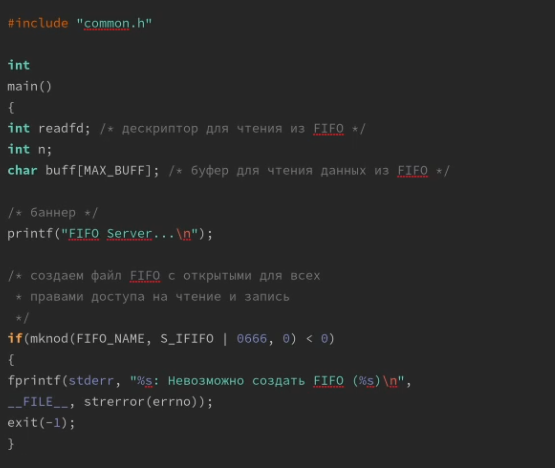
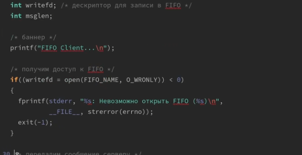
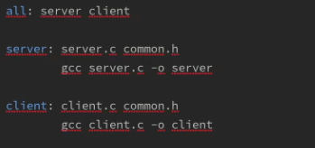
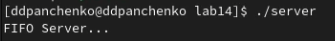
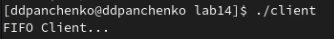

---
## Front matter
title: "Лабораторная работа №14"
subtitle: "Именованные каналы"
author: "Панченко Денис Дмитриевич"

## Generic otions
lang: ru-RU
toc-title: "Содержание"

## Bibliography
bibliography: bib/cite.bib
csl: pandoc/csl/gost-r-7-0-5-2008-numeric.csl

## Pdf output format
toc: true # Table of contents
toc-depth: 2
lof: true # List of figures
lot: false # List of tables
fontsize: 12pt
linestretch: 1.5
papersize: a4
documentclass: scrreprt
## I18n polyglossia
polyglossia-lang:
  name: russian
  options:
	- spelling=modern
	- babelshorthands=true
polyglossia-otherlangs:
  name: english
## I18n babel
babel-lang: russian
babel-otherlangs: english
## Fonts
mainfont: PT Serif
romanfont: PT Serif
sansfont: PT Sans
monofont: PT Mono
mainfontoptions: Ligatures=TeX
romanfontoptions: Ligatures=TeX
sansfontoptions: Ligatures=TeX,Scale=MatchLowercase
monofontoptions: Scale=MatchLowercase,Scale=0.9
## Biblatex
biblatex: true
biblio-style: "gost-numeric"
biblatexoptions:
  - parentracker=true
  - backend=biber
  - hyperref=auto
  - language=auto
  - autolang=other*
  - citestyle=gost-numeric
## Pandoc-crossref LaTeX customization
figureTitle: "Рис."
tableTitle: "Таблица"
listingTitle: "Листинг"
lofTitle: "Список иллюстраций"
lotTitle: "Список таблиц"
lolTitle: "Листинги"
## Misc options
indent: true
header-includes:
  - \usepackage{indentfirst}
  - \usepackage{float} # keep figures where there are in the text
  - \floatplacement{figure}{H} # keep figures where there are in the text
---

# Цель работы

Приобретение практических навыков работы с именованными каналами.

# Выполнение лабораторной работы

Создадим файлы: common.h, server.c, client.c, Makefile (рис. @fig:001).

{#fig:001 width=70%}

Файл common.h (рис. @fig:002).

{#fig:002 width=70%}

Файл server.c (рис. @fig:003).

{#fig:003 width=70%}

Файл client.c (рис. @fig:004).

{#fig:004 width=70%}

Makefile (рис. @fig:005).

{#fig:005 width=70%}

Запуск server.c (рис. @fig:006).

{#fig:006 width=70%}

Запуск client.c (рис. @fig:007).

{#fig:007 width=70%}

# Вывод

Я приобрел практические навыки работы с именованными каналами.

# Контрольные вопросы

1. Именованные каналы (FIFO) - это файлы, находящиеся в файловой системе, которые используются для обмена данными между процессами. Неименованные каналы - это временные файлы, создаваемые с помощью системного вызова pipe, которые используются для передачи данных между процессами, запущенными в рамках одного компьютера.

2. Нет, создание неименованного канала из командной строки невозможно.

3. Да, создание именованного канала из командной строки возможно с помощью утилиты mkfifo.

4. Функция pipe создает неименованный канал и возвращает два файловых дескриптора, один для чтения и один для записи в канал.

5. Функция mkfifo создает именованный канал с заданным именем и правами доступа и возвращает 0 в случае успешного создания и -1 в случае ошибки.

6. При чтении из FIFO меньшего числа байтов, чем находится в канале, процесс будет заблокирован до тех пор, пока не появятся новые данные в канале. При чтении большего числа байтов, процесс получит только те данные, которые есть в канале на данный момент.

7. При записи в FIFO меньшего числа байтов, чем позволяет буфер, данные будут записаны в канал, но процесс записи не будет завершен до тех пор, пока не будет записано достаточное количество данных, чтобы заполнить буфер. При записи большего числа байтов, данные будут записаны в канал, а оставшиеся данные будут ожидать записи в буфере.

8. Два или более процессов могут читать или записывать в канал, но при этом может возникнуть проблема "гонки" (race condition), когда два процесса пытаются одновременно читать или записывать в канал. Для решения этой проблемы необходимо использовать синхронизацию процессов.

9. Функция write используется для записи данных в файл или файлоподобное устройство. Возвращает количество записанных байтов или -1 в случае ошибки. Число 1 в вызове функции в программе server.c (строка 42) означает, что записывается 1 байт.

10. Функция strerror возвращает строку с описанием ошибки, соответствующей заданному коду errno. Она принимает один аргумент - код ошибки errno. Например, strerror(errno) вернет строку, описывающую ошибку, которая произошла в программе.
