---
## Front matter
lang: ru-RU
title: Проект. Персональный сайт научного работника
subtitle: Первый этап
author:
  - Панченко Д. Д.
institute:
  - Российский университет дружбы народов, Москва, Россия
date: 18 февраля 2023

## i18n babel
babel-lang: russian
babel-otherlangs: english

## Formatting pdf
toc: false
toc-title: Содержание
slide_level: 2
aspectratio: 169
section-titles: true
theme: metropolis
header-includes:
 - \metroset{progressbar=frametitle,sectionpage=progressbar,numbering=fraction}
 - '\makeatletter'
 - '\beamer@ignorenonframefalse'
 - '\makeatother'
---

# Информация

## Докладчик

  * Панченко Денис Дмитриевич
  * Студент 1 курса факультета физико-математических наук.
  * Российский университет дружбы народов
  * [derenchikde@gmail.com](mailto:derenchikde@gmail.com)

## Цели и задачи

Разместить на Github pages заготовку для персонального сайта.

## Задание

1. Установить необходимое программное обеспечение.
2. Скачать шаблон темы сайта.
3. Разместить его на хостинге git.
4. Установить параметр для URLs сайта.
5. Разместить заготовку сайта на Github pages.

# Выполнение проекта

## Устанавливаем hugo.

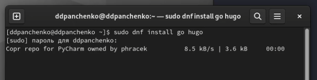{#fig:001 width=70%}

## Создаем репозиторий в github с шаблоном сайта.

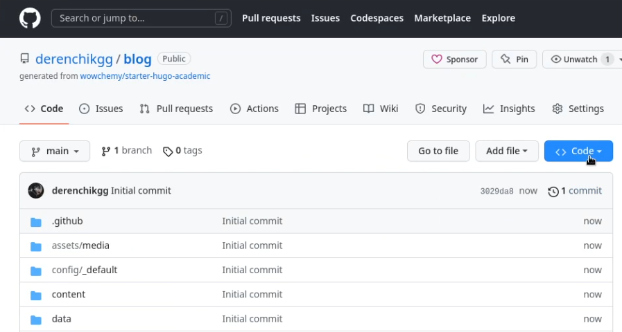{#fig:002 width=70%}

## Создаем на нашем компьютере каталог с репозиторием.

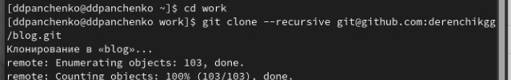{#fig:003 width=70%}

## Запускаем hugo.

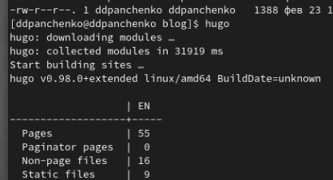{#fig:004 width=70%}

## Запускаем hugo server.

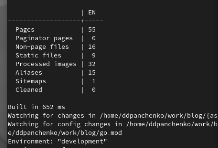{#fig:005 width=70%}

## Переходим на созданный нами сайт.

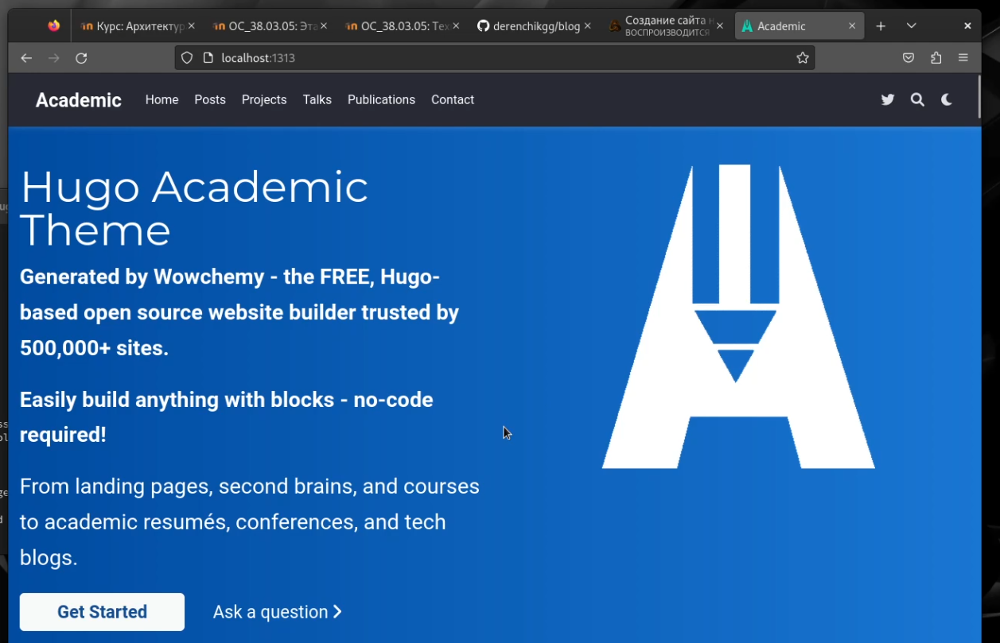{#fig:006 width=70%}

## Создаем параметр URL для сайта в github.

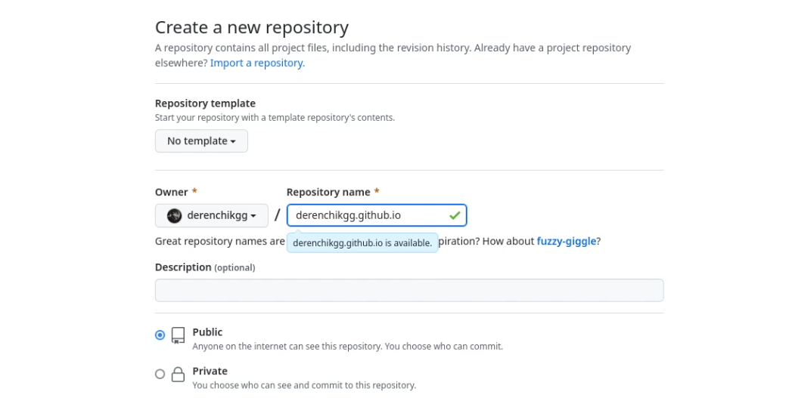{#fig:007 width=70%}

## Создаем на нашем компьютере каталог с данным параметром.

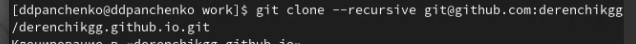{#fig:008 width=70%}

## Создаем в этом каталоге ветку main.

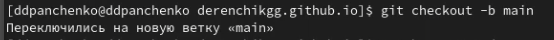{#fig:009 width=70%}

## Создаем в этом каталоге файл и отправляем его на github, чтобы наш репозиторий заработал.

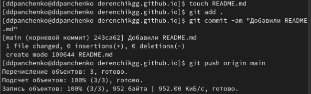{#fig:010 width=70%}

## Создаем в каталоге blog папку public.

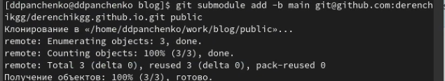{#fig:011 width=70%}

## Запускаем hugo, чтобы загрузить все нужные файлы в эту папку.

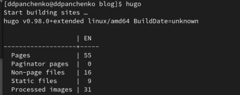{#fig:012 width=70%}

## Отправляем это все на github.

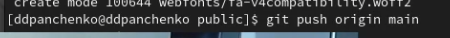{#fig:013 width=70%}

## Открываем наш сайт.

{#fig:014 width=70%}

# Вывод

Я разместил на Github pages заготовку для персонального сайта.
