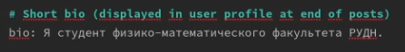
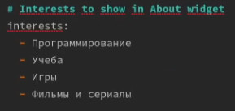
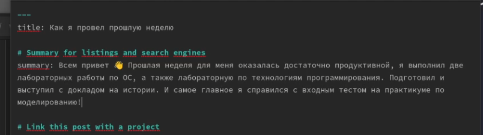
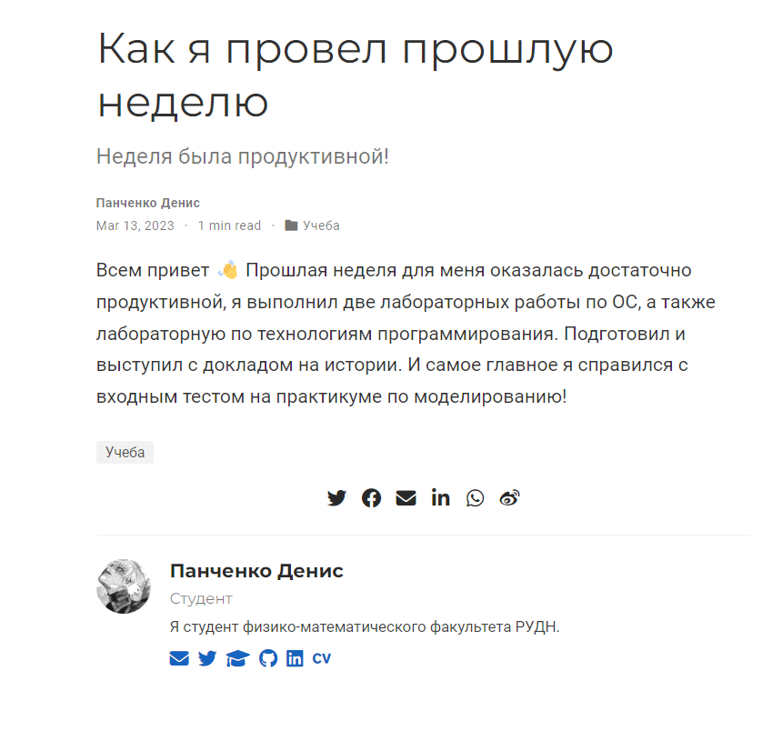
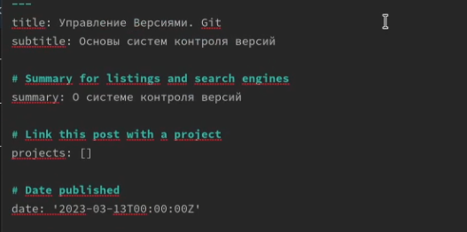
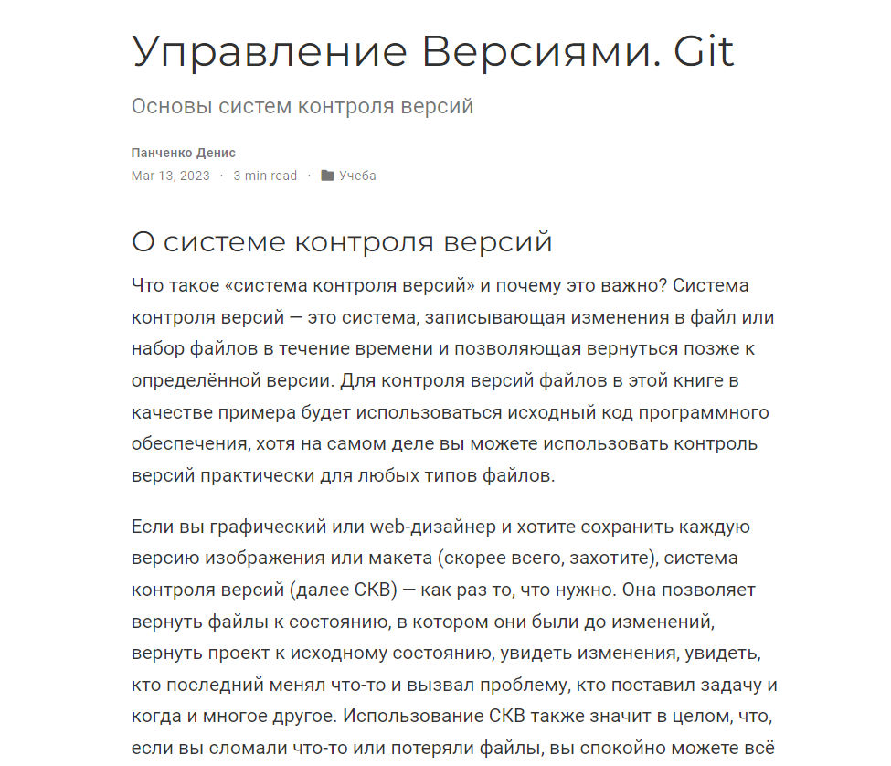
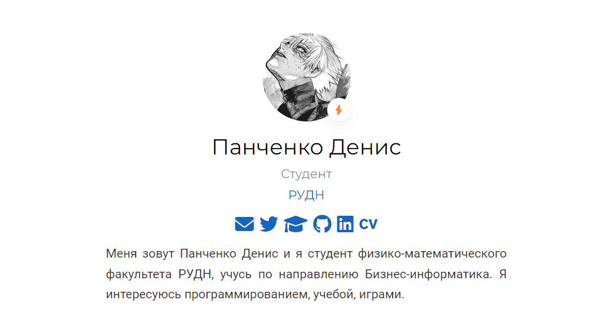

---
## Front matter
lang: ru-RU
title: Проект. Персональный сайт научного работника
subtitle: Второй этап
author:
  - Панченко Д. Д.
institute:
  - Российский университет дружбы народов, Москва, Россия
date: 13 марта 2023

## i18n babel
babel-lang: russian
babel-otherlangs: english

## Formatting pdf
toc: false
toc-title: Содержание
slide_level: 2
aspectratio: 169
section-titles: true
theme: metropolis
header-includes:
 - \metroset{progressbar=frametitle,sectionpage=progressbar,numbering=fraction}
 - '\makeatletter'
 - '\beamer@ignorenonframefalse'
 - '\makeatother'
---

# Информация

## Докладчик

  * Панченко Денис Дмитриевич
  * Студент 1 курса факультета физико-математических наук.
  * Российский университет дружбы народов
  * [derenchikde@gmail.com](mailto:derenchikde@gmail.com)

## Цели и задачи

Добавить к сайту данные о себе.

## Задание

1. Разместить фотографию владельца сайта.
2. Разместить краткое описание владельца сайта.
3. Добавить информацию об интересах.
4. Добавить информацию от образовании.
5. Сделать пост по прошедшей неделе.
6. Добавить пост на тему: Управление версиями. Git.

# Выполнение проекта

## Размещаем фотографию.

{#fig:001 width=70%}

## Размещаем краткое описание владельца сайта.

{#fig:002 width=70%}

## Добавляем информацию об интересах.

{#fig:003 width=70%}

## Добавляем информацию от образовании.

{#fig:004 width=70%}

## Делаем пост по прошедшей неделе.

{#fig:005 width=70%}

##

{#fig:006 width=70%}

## Добавляем пост на тему: Управление версиями. Git.

{#fig:007 width=70%}

##

{#fig:008 width=70%}

# Вывод

Я добавил к сайту данные о себе.

{#fig:009 width=70%}
