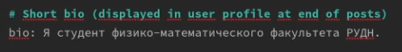
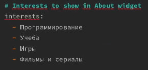
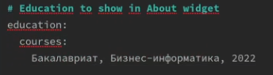
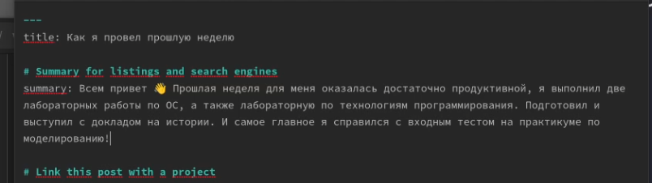
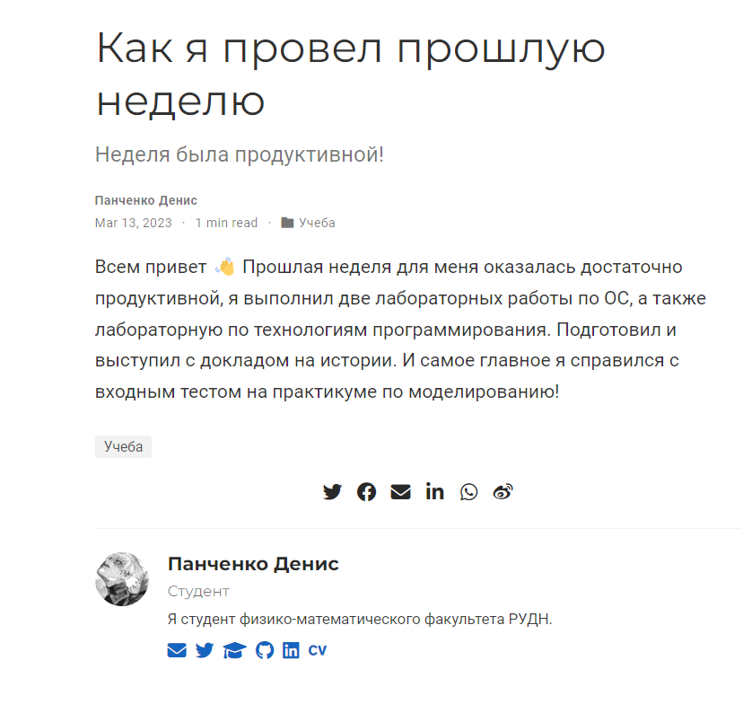
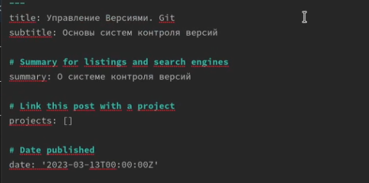
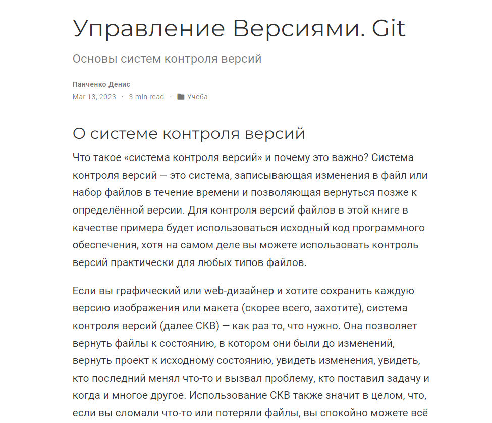
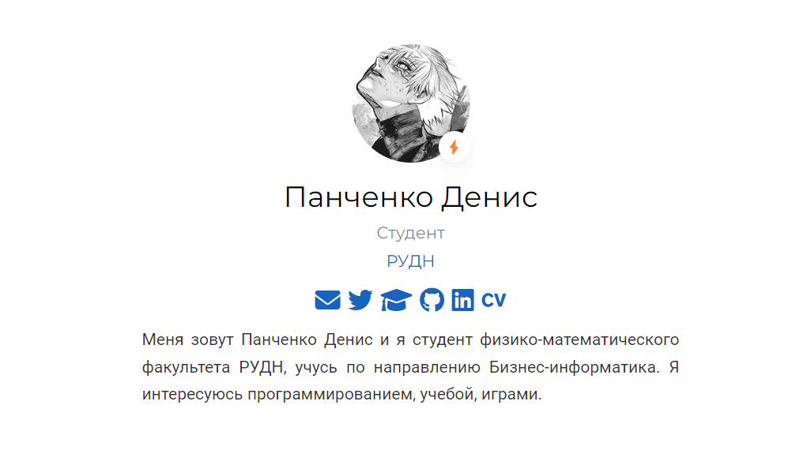

---
## Front matter
title: "Проект. Персональный сайт научного работника"
subtitle: "Второй этап"
author: "Панченко Денис Дмитриевич"

## Generic otions
lang: ru-RU
toc-title: "Содержание"

## Bibliography
bibliography: bib/cite.bib
csl: pandoc/csl/gost-r-7-0-5-2008-numeric.csl

## Pdf output format
toc: true # Table of contents
toc-depth: 2
lof: true # List of figures
lot: false # List of tables
fontsize: 12pt
linestretch: 1.5
papersize: a4
documentclass: scrreprt
## I18n polyglossia
polyglossia-lang:
  name: russian
  options:
	- spelling=modern
	- babelshorthands=true
polyglossia-otherlangs:
  name: english
## I18n babel
babel-lang: russian
babel-otherlangs: english
## Fonts
mainfont: PT Serif
romanfont: PT Serif
sansfont: PT Sans
monofont: PT Mono
mainfontoptions: Ligatures=TeX
romanfontoptions: Ligatures=TeX
sansfontoptions: Ligatures=TeX,Scale=MatchLowercase
monofontoptions: Scale=MatchLowercase,Scale=0.9
## Biblatex
biblatex: true
biblio-style: "gost-numeric"
biblatexoptions:
  - parentracker=true
  - backend=biber
  - hyperref=auto
  - language=auto
  - autolang=other*
  - citestyle=gost-numeric
## Pandoc-crossref LaTeX customization
figureTitle: "Рис."
tableTitle: "Таблица"
listingTitle: "Листинг"
lofTitle: "Список иллюстраций"
lotTitle: "Список таблиц"
lolTitle: "Листинги"
## Misc options
indent: true
header-includes:
  - \usepackage{indentfirst}
  - \usepackage{float} # keep figures where there are in the text
  - \floatplacement{figure}{H} # keep figures where there are in the text
---

# Цель работы

Добавить к сайту данные о себе.

# Задание

1. Разместить фотографию владельца сайта.
2. Разместить краткое описание владельца сайта.
3. Добавить информацию об интересах.
4. Добавить информацию от образовании.
5. Сделать пост по прошедшей неделе.
6. Добавить пост на тему: Управление версиями. Git.

# Выполнение проекта

Размещаем фотографию (рис. @fig:001).

{#fig:001 width=70%}

Размещаем краткое описание владельца сайта (рис. @fig:002).

{#fig:002 width=70%}

Добавляем информацию об интересах (рис. @fig:003).

{#fig:003 width=70%}

Добавляем информацию от образовании (рис. @fig:004).

{#fig:004 width=70%}

Делаем пост по прошедшей неделе (рис. @fig:005 - @fig:006).

{#fig:005 width=70%}

{#fig:006 width=70%}

Добавляем пост на тему: Управление версиями. Git (рис. @fig:007 - @fig:008).

{#fig:007 width=70%}

{#fig:008 width=70%}

# Вывод

Я добавил к сайту данные о себе.

{#fig:009 width=70%}
