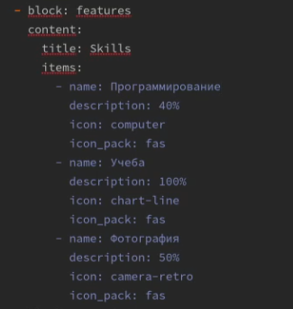
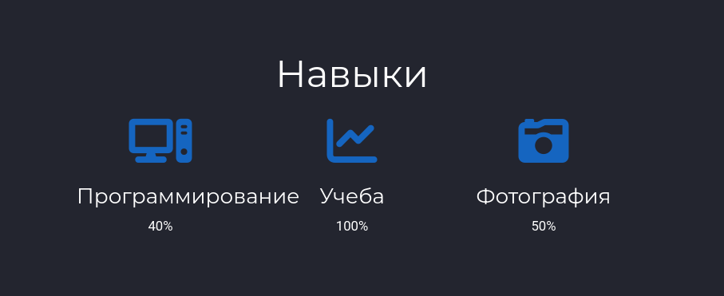
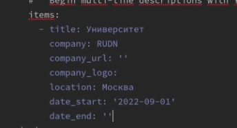
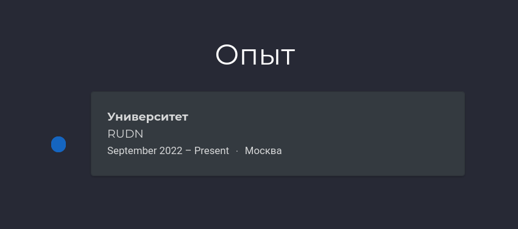
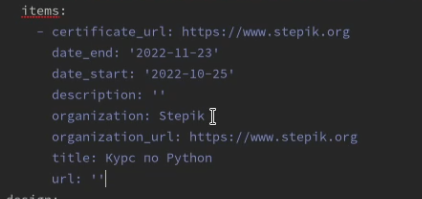
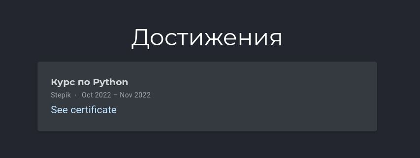
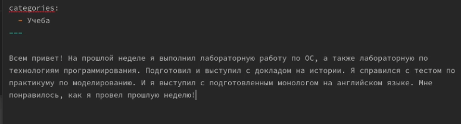
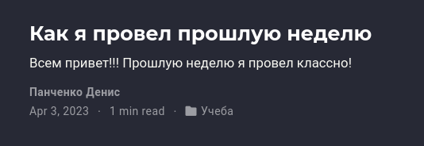
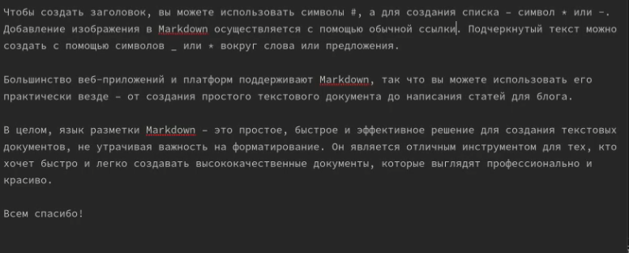
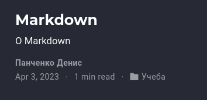

---
## Front matter
lang: ru-RU
title: Проект. Персональный сайт научного работника
subtitle: Третий этап
author:
  - Панченко Д. Д.
institute:
  - Российский университет дружбы народов, Москва, Россия
date: 3 апреля 2023

## i18n babel
babel-lang: russian
babel-otherlangs: english

## Formatting pdf
toc: false
toc-title: Содержание
slide_level: 2
aspectratio: 169
section-titles: true
theme: metropolis
header-includes:
 - \metroset{progressbar=frametitle,sectionpage=progressbar,numbering=fraction}
 - '\makeatletter'
 - '\beamer@ignorenonframefalse'
 - '\makeatother'
---

# Информация

## Докладчик

  * Панченко Денис Дмитриевич
  * Студент 1 курса факультета физико-математических наук.
  * Российский университет дружбы народов
  * [derenchikde@gmail.com](mailto:derenchikde@gmail.com)

## Цели и задачи

Добавить к сайту даостижения.

## Задание

1. Добавить информацию о навыках.
2. Добавить информацию об опыте.
3. Добавить информацию о достижениях.
4. Сделать пост по прошедшей неделе.
5. Добавить пост на тему: Язык разметки Markdown.

# Выполнение проекта

## Добавляем информацию о навыках.

{#fig:001 width=70%}

## 

{#fig:002 width=70%}

## Добавляем информацию об опыте.

{#fig:003 width=70%}

## 

{#fig:004 width=70%}

## Добавляем информацию о достижениях.

{#fig:005 width=70%}

## 

{#fig:006 width=70%}

## Делаем пост по прошедшей неделе.

{#fig:007 width=70%}

## 

{#fig:008 width=70%}

## Добавляем пост на тему: Язык разметки Markdown.

{#fig:009 width=70%}

## 

{#fig:010 width=70%}

# Вывод

Я добавил к сайту достижения.
