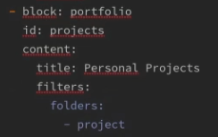
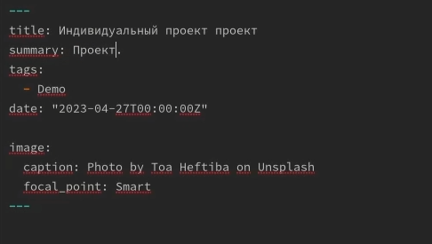
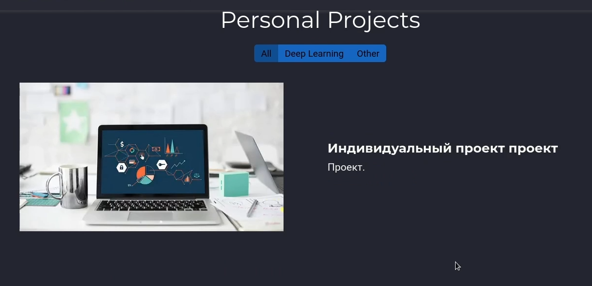
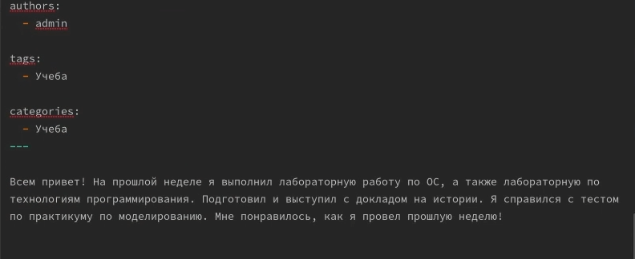
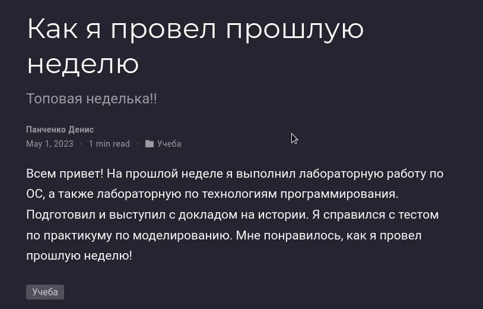
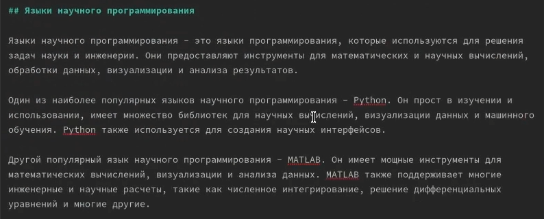
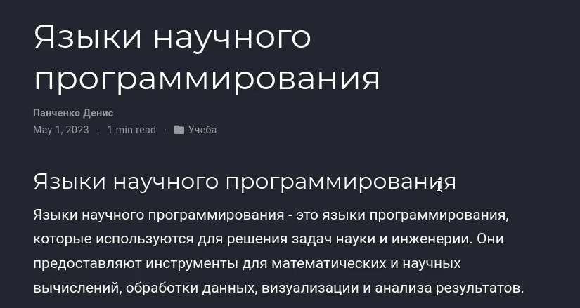

---
## Front matter
lang: ru-RU
title: Проект. Персональный сайт научного работника
subtitle: Пятый этап
author:
  - Панченко Д. Д.
institute:
  - Российский университет дружбы народов, Москва, Россия
date: 1 мая 2023

## i18n babel
babel-lang: russian
babel-otherlangs: english

## Formatting pdf
toc: false
toc-title: Содержание
slide_level: 2
aspectratio: 169
section-titles: true
theme: metropolis
header-includes:
 - \metroset{progressbar=frametitle,sectionpage=progressbar,numbering=fraction}
 - '\makeatletter'
 - '\beamer@ignorenonframefalse'
 - '\makeatother'
---

# Информация

## Докладчик

  * Панченко Денис Дмитриевич
  * Студент 1 курса факультета физико-математических наук.
  * Российский университет дружбы народов
  * [derenchikde@gmail.com](mailto:derenchikde@gmail.com)

## Цели и задачи

Добавить к сайту все остальные элементы.

## Задание

1. Сделать записи для персональных проектов.
2. Сделать пост по прошедшей неделе.
3. Добавить пост на тему: Языки научного программирования.

# Выполнение проекта

## Делаем записи для персональных проектов.

{#fig:001 width=70%}

## 

{#fig:002 width=70%}

## 

{#fig:003 width=70%}

## Добавляем пост по прошедшей неделе.

{#fig:004 width=70%}

## 

{#fig:005 width=70%}

## Добавляем пост на тему: создание презентаций.

{#fig:006 width=70%}

## 

{#fig:007 width=70%}

# Вывод

Я добавил к сайту все остальные элементы.
